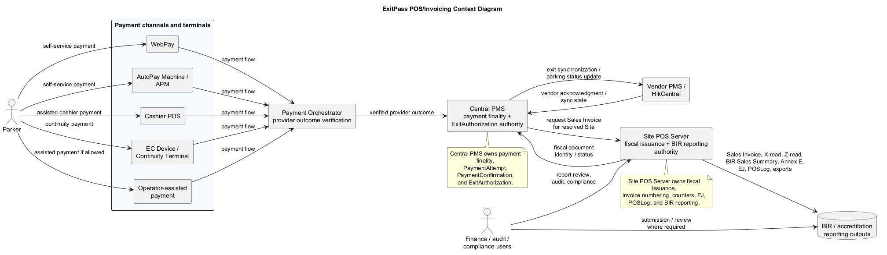
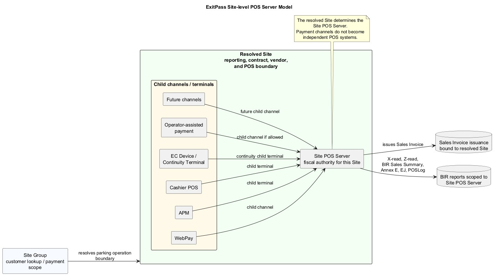
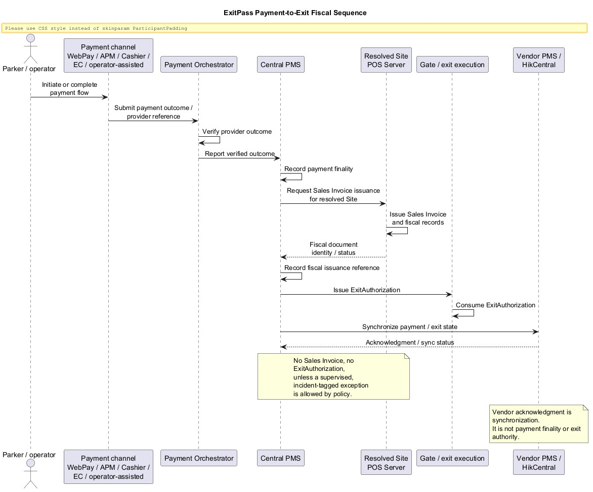
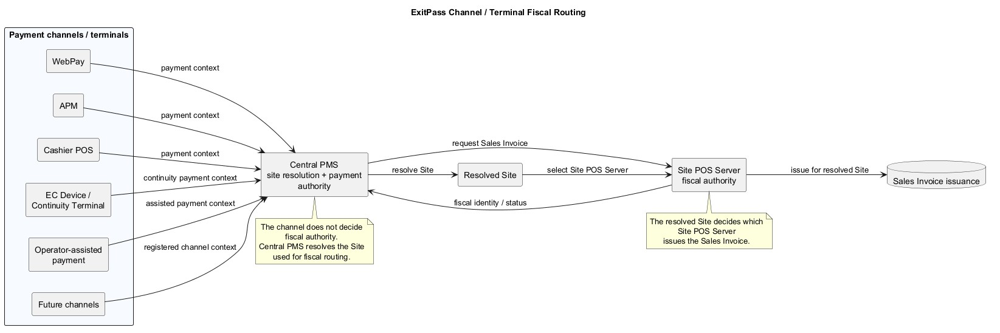
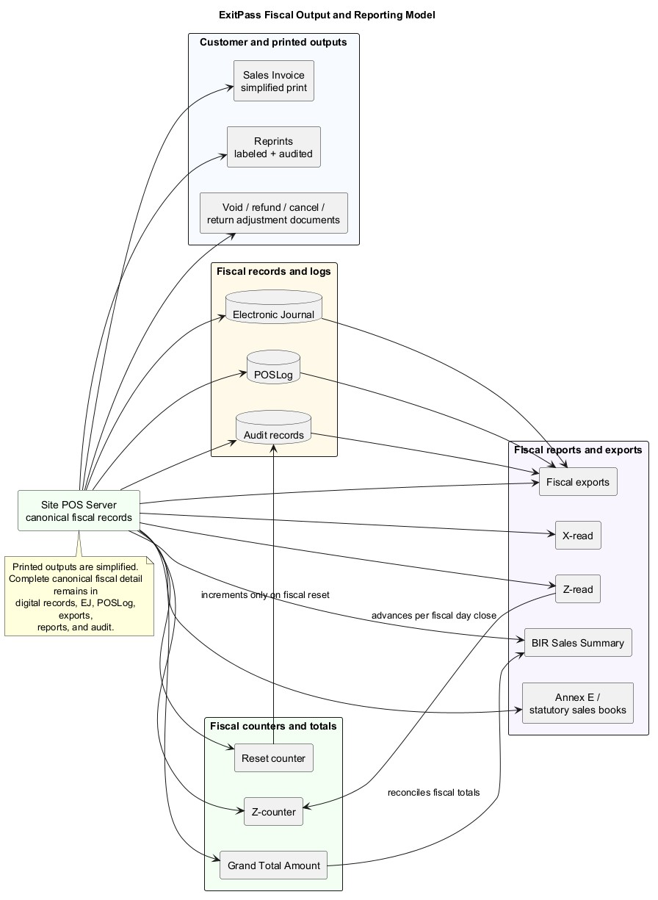
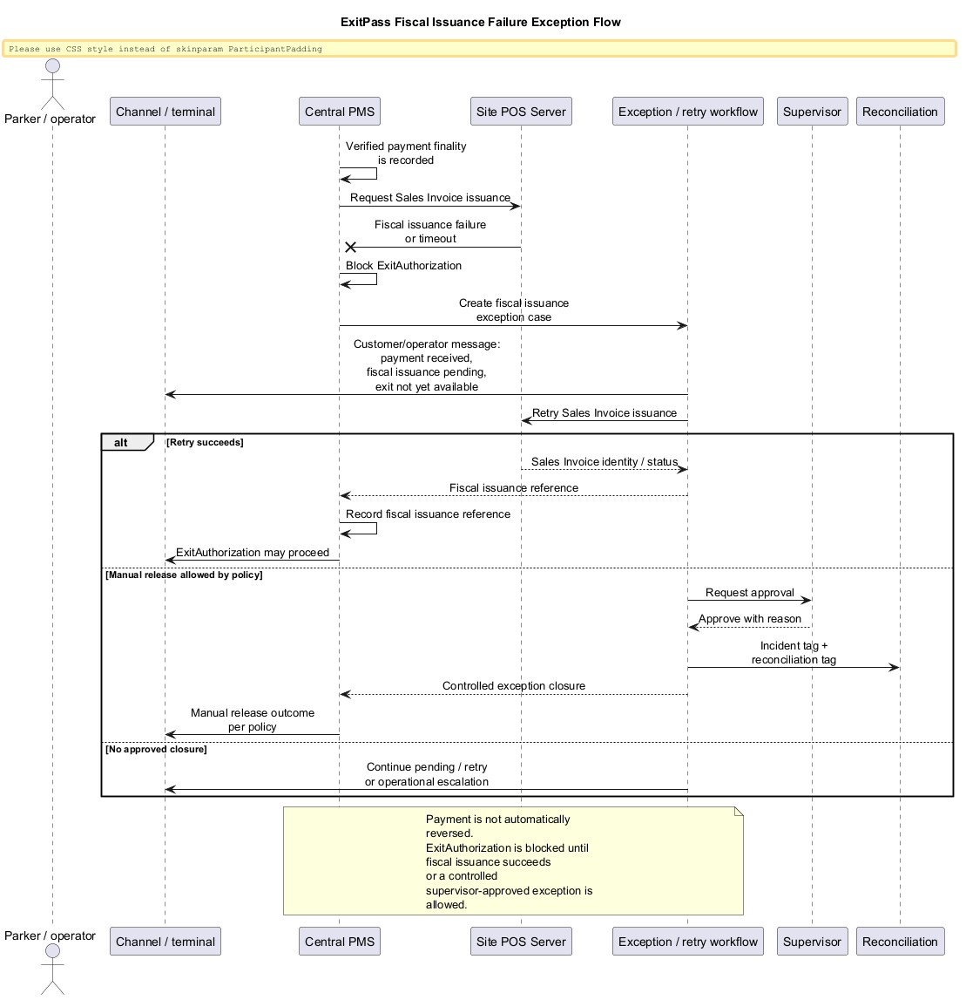

# ExitPass POS/Invoicing BRD v1.0

## 1. Document Control

| Field | Value |
| --- | --- |
| Document title | ExitPass POS/Invoicing Business Requirements Document |
| Version | v1.0 Markdown draft |
| Product scope | ExitPass v1.3 POS/Invoicing |
| Status | Approved baseline |
| Generated | 2026-06-25 |
| Output format | Markdown only |

Approval note: `ExitPass_POS_Invoicing_BRD_v1.0.md` is approved as the POS/Invoicing business requirements baseline for ExitPass v1.3 documentation and downstream POS Server System Design work.

## 2. Executive Summary

ExitPass shall provide a BIR-authorized POS/Invoicing capability for applicable parking payment channels across the platform. The capability is not limited to AutoPay Machines. WebPay, AutoPay Machines, Cashier POS, EC Device / Continuity Terminal, operator-assisted payment where allowed, and future payment channels shall route fiscal issuance through the resolved Site-level POS Server.

Parking payment fiscal output for ExitPass v1.3 shall be Sales Invoice. Related fiscal workflows may require adjustment documents, void/refund/cancel/return documents, credit memo/debit memo equivalents, or other BIR-required fiscal documents, but the primary parking payment output is Sales Invoice.

BIR recommended the Site-level POS Server model. Each Site or parking operation boundary shall have one Site-level POS Server. The resolved Site determines which POS Server issues the Sales Invoice. Payment channels and terminals are children of the Site POS Server and must not be modeled as separate independent POS systems.

Central PMS remains the authority for parking session control state, site resolution, payment finality, PaymentAttempt, PaymentConfirmation, ExitAuthorization, and the payment-linked platform authority chain. POS Server owns fiscal issuance and fiscal reporting. Fiscal issuance must succeed before Central PMS issues ExitAuthorization.

## 3. Business Context

ExitPass v1.2 established core parking session, tariff, payment, provider outcome, and ExitAuthorization authority boundaries. It also introduced Operator Console controls for site, device, shift, statutory discount validation, audit, and operational reporting.

ExitPass v1.3 POS/Invoicing extends the platform with fiscal capabilities required for BIR-aligned parking payment operations. The platform must issue Sales Invoices and produce supporting fiscal reports for all applicable payment channels while preserving the existing v1.2 authority model.

The BIR and Hikvision APM materials are important source references for fiscal output, X-read, Z-read, Electronic Journal, POSLog, BIR Sales Summary, Annex E reports, reprint, void/refund/cancel/return, and accreditation controls. They are not the target architecture by themselves. The target architecture is platform-wide Site-level POS/Invoicing.

## 4. Problem Statement

ExitPass currently has platform authority for parking sessions, payment finality, and ExitAuthorization, but does not yet define a platform-wide POS/Invoicing business capability. Without this capability:

- Fiscal issuance can become fragmented by payment channel.
- WebPay, APM, cashier, EC/continuity, and operator-assisted flows may diverge in fiscal behavior.
- BIR Sales Summary, X-read, Z-read, Annex E reporting, EJ, POSLog, and fiscal audit controls may be incomplete or channel-specific.
- ExitAuthorization could be issued without a completed fiscal issuance reference if the payment-to-exit workflow is not controlled.
- Tax, entitlement, discount, VAT privilege, and adjustment treatment may be buried inside tariff/payment data rather than explicit fiscal lines and reports.

## 5. Product Purpose

The purpose of ExitPass POS/Invoicing is to provide a platform-wide fiscal issuance and reporting capability for parking payments. The capability shall:

- Issue Sales Invoices for successful parking payments.
- Route fiscal issuance through the resolved Site-level POS Server.
- Preserve Central PMS as payment finality and ExitAuthorization authority.
- Produce required fiscal reports, fiscal audit records, exports, EJ, POSLog, X-read, Z-read, and BIR Sales Summary.
- Support entitlement and fiscal treatment categories including Senior Citizen, PWD, NAAC, Solo Parent, and Diplomat VAT Privilege / VAT Exemption.
- Maintain tamper-evident fiscal records and counter continuity.

## 6. Scope

### In Scope

- Platform-wide POS/Invoicing business requirements for ExitPass v1.3.
- Sales Invoice issuance for parking payments.
- Site-level POS Server model.
- Channel and terminal model for WebPay, APM, Cashier POS, EC Device / Continuity Terminal, operator-assisted payment if allowed, and future channels.
- Central PMS and POS Server authority split.
- Payment-to-exit choreography requiring fiscal issuance before ExitAuthorization.
- X-read, Z-read, reset counter, Z-counter, and Grand Total Amount business requirements.
- BIR Sales Summary and Annex E reporting requirements.
- Entitlement, discount, VAT privilege, and fiscal line classification requirements.
- Void, refund, cancel, return, and reprint business control requirements.
- Fiscal audit, EJ, POSLog, export, retention, privacy, and reconciliation requirements.
- Open questions requiring BIR/accounting, compliance, or POS Server System Design resolution.

### Out of Scope

- POS Server technical system design.
- Database schema design or migration.
- API endpoint, DTO, event, or contract design.
- Source code changes.
- Payment provider integration redesign.
- Gate integration redesign.
- Final print layout pixel-perfect design.
- Final BIR submission package.
- DOCX generation.
- Hikvision APM-only design.

## 7. Stakeholders and Users

| Stakeholder / user | Role in POS/Invoicing |
| --- | --- |
| Parking customer | Receives Sales Invoice and payment/exit status messaging. |
| Site cashier | Processes cashier POS payments, reprints, controlled adjustments, and cashier accountability actions if authorized. |
| Site operator | Supports customer payment or entitlement workflows where allowed, without bypassing Central PMS authority. |
| Supervisor | Approves controlled exceptions, manual release if allowed, fiscal reset/recovery, void/refund/cancel/return controls, and sensitive fiscal actions. |
| Finance/accounting | Owns fiscal treatment, VAT/tax configuration, reports, and reconciliation signoff. |
| Compliance/audit | Reviews fiscal records, EJ, POSLog, reports, evidence, exports, and retention controls. |
| Operations | Manages site-level workflows, terminals, cashier sessions, business continuity, and degraded operation procedures. |
| Engineering | Designs and implements POS Server, channel integrations, controls, and supporting platform changes after BRD approval. |
| BIR/accreditation advisor | Confirms fiscal document, report, numbering, layout, identity, evidence, and compliance treatment. |
| Hikvision/APM vendor | Supports APM printing, hardware behavior, fiscal payload rendering, and APM integration under the Site POS Server model. |

## 8. Business Objectives

| ID | Objective |
| --- | --- |
| BO-001 | Provide a BIR-authorized POS/Invoicing capability for applicable parking payments across all ExitPass payment channels. |
| BO-002 | Ensure Sales Invoice issuance is controlled by the resolved Site POS Server. |
| BO-003 | Preserve the Central PMS authority model for parking session state, payment finality, and ExitAuthorization. |
| BO-004 | Ensure fiscal issuance succeeds before ExitAuthorization is issued. |
| BO-005 | Produce BIR-required and business-required fiscal reports, including BIR Sales Summary, X-read, Z-read, EJ, POSLog, and Annex E reports. |
| BO-006 | Support immediate and future entitlement categories without redesigning the fiscal model. |
| BO-007 | Preserve fiscal counter, sequence, Grand Total Amount, and EJ continuity across reset, failover, restore, repair, and recovery events. |
| BO-008 | Provide auditable controls for reprints, void/refund/cancel/return actions, exports, fiscal resets, and recovery. |

## 9. POS/Invoicing Concept Overview

ExitPass POS/Invoicing is a fiscal capability that sits beside, not inside, Central PMS payment finality. Central PMS determines that payment finality has occurred. POS Server issues the Sales Invoice and fiscal records for the resolved Site. Central PMS records the fiscal issuance reference and then issues ExitAuthorization.

The POS Server is not a payment provider. It is not a gate authorization service. It is not a tariff authority by itself. It is the fiscal authority for the Site.

The POS Server shall maintain the fiscal facts required to reconstruct, audit, export, and report parking fiscal transactions, including Sales Invoice payloads, fiscal lines, counters, reports, EJ, POSLog, reprints, adjustments, and fiscal audit events.

## 10. Site-level POS Server Model

The system shall use one Site-level POS Server per Site or parking operation boundary.

The Site POS Server shall be the fiscal authority for the resolved Site.

The resolved Site shall determine which Site POS Server issues the Sales Invoice.

The Site POS Server shall own fiscal numbering, reset counter, Z-counter, Grand Total Amount, X-read, Z-read, BIR Sales Summary, Annex E reporting, EJ, POSLog, fiscal audit, reprint controls, fiscal adjustment controls, retention, and export.

The system shall not model WebPay, APM, Cashier POS, EC Device / Continuity Terminal, operator-assisted payment, or future channels as separate independent POS systems for the same Site.

The exact assignment of MIN, PTU, serial number, terminal number, software version, supplier accreditation metadata, and related fiscal identity fields between Site POS Server and channels/terminals remains open for BIR/accounting confirmation.

## 11. Payment Channel and Terminal Model

Payment channels and terminals shall be modeled as children of the Site POS Server.

The following channel/terminal types shall be supported in the model:

- WebPay
- AutoPay Machine / APM
- Cashier POS
- EC Device / Continuity Terminal
- Operator-assisted payment if allowed
- Future payment channels

Each channel or terminal shall provide enough context for the Site POS Server to associate fiscal issuance with the resolved Site, payment, parking session, channel, terminal, and responsible actor where applicable.

The system shall support future channel registration without creating a separate fiscal authority for each new channel.

## 12. Authority Model

| Authority area | Owner | Business rule |
| --- | --- | --- |
| Parking session control state | Central PMS | Central PMS remains the platform source of truth for canonical parking session state. |
| Site resolution | Central PMS | Central PMS owns or provides the authoritative resolved Site used for POS Server routing. |
| PaymentAttempt | Central PMS | Payment attempts remain part of the Central PMS payment authority chain. |
| PaymentConfirmation | Central PMS | Verified payment finality is recorded under Central PMS authority. |
| Payment finality | Central PMS | Payment Orchestrator and WebPay must not declare platform payment finality. |
| ExitAuthorization | Central PMS | POS Server must not issue ExitAuthorization. Gate/exit execution must not bypass Central PMS authorization. |
| Sales Invoice issuance | Site POS Server | POS Server issues Sales Invoice after Central PMS verified payment finality. |
| Fiscal reports and counters | Site POS Server | POS Server owns fiscal numbering, reset counter, Z-counter, Grand Total Amount, X/Z reports, BIR summary, EJ, and POSLog. |
| Fiscal adjustments | Site POS Server and Central PMS | POS Server owns fiscal adjustment documents. Central PMS owns payment reversal/refund finality. Workflow sequencing remains open. |

## 13. Business Process Overview

### Standard Payment-To-Exit Flow

1. A customer or operator initiates payment through an applicable channel.
2. The platform resolves the parking session and Site through Central PMS authority.
3. Central PMS manages or receives verified payment finality.
4. Central PMS requests Sales Invoice issuance from the resolved Site POS Server.
5. POS Server validates fiscal issuance eligibility and issues the Sales Invoice.
6. POS Server returns fiscal document identity/status to Central PMS.
7. Central PMS records the fiscal issuance reference.
8. Central PMS issues ExitAuthorization.
9. The channel or terminal presents the Sales Invoice and exit/payment status according to its user experience.

### Fiscal Issuance Failure Flow

If fiscal issuance fails or times out after payment finality:

- Central PMS shall not reverse payment finality automatically.
- Central PMS shall not issue ExitAuthorization yet.
- The case shall enter a controlled fiscal issuance exception/retry workflow.
- The customer/operator message shall indicate that payment was received but fiscal issuance is pending and exit authorization is not yet available.
- Manual release, if allowed, shall require supervisor approval, incident tagging, and reconciliation tagging.
- POS Server shall not issue ExitAuthorization.
- Payment Orchestrator and WebPay shall not bypass Central PMS.

## 14. Functional Requirements

### Platform Scope

| ID | Requirement |
| --- | --- |
| FR-001 | The system shall provide platform-wide POS/Invoicing for applicable parking payment channels. |
| FR-002 | The system shall route fiscal issuance through the resolved Site POS Server. |
| FR-003 | The system shall treat Sales Invoice as the primary fiscal output for parking payments. |
| FR-004 | The system shall preserve Central PMS as authority for payment finality and ExitAuthorization. |
| FR-005 | The POS Server shall not issue ExitAuthorization. |
| FR-006 | Payment Orchestrator and WebPay shall not declare platform payment finality. |

### Fiscal Issuance

| ID | Requirement |
| --- | --- |
| FR-007 | Central PMS shall request Sales Invoice issuance only after verified payment finality. |
| FR-008 | POS Server shall issue a Sales Invoice for a successful parking payment before ExitAuthorization is issued. |
| FR-009 | Central PMS shall record the fiscal issuance reference before issuing ExitAuthorization. |
| FR-010 | POS Server shall return fiscal document identity and issuance status to Central PMS. |
| FR-011 | The system shall prevent channel-level bypass of Site POS Server fiscal issuance. |

### Fiscal Records And Reports

| ID | Requirement |
| --- | --- |
| FR-012 | POS Server shall maintain fiscal records sufficient to support Sales Invoice rendering, audit, EJ, POSLog, BIR Sales Summary, X-read, Z-read, and Annex E reporting. |
| FR-013 | POS Server shall support simplified printed output and detailed canonical digital fiscal records. |
| FR-014 | POS Server shall support fiscal reprint controls that label and audit reprints. |
| FR-015 | POS Server shall support controlled fiscal adjustment workflows for void, refund, cancel, and return documents. |

### Fiscal Counters

| ID | Requirement |
| --- | --- |
| FR-016 | POS Server shall maintain a reset counter that starts from zero. |
| FR-017 | POS Server shall increment reset counter only when a fiscal reset event occurs. |
| FR-018 | POS Server shall maintain a Z-counter that advances per Z-reading / fiscal day close. |
| FR-019 | POS Server shall maintain Grand Total Amount accumulator and audit references. |
| FR-020 | POS Server shall preserve previous Grand Total Amount, previous reset counter, reset timestamp, reset reason, approving user, and recovery/reference notes when reset occurs. |

### Fiscal Lines And Entitlements

| ID | Requirement |
| --- | --- |
| FR-021 | POS Server shall support explicit fiscal line classification independent of tariff snapshots alone. |
| FR-022 | POS Server shall support VATable sales, VAT-exempt sales, zero-rated sales, non-VAT sales, statutory discounts, VAT privileges/exemptions, coupons, penalties, lost ticket fees, overstay charges, service charges, and other fiscal adjustments. |
| FR-023 | POS Server shall support Senior Citizen and PWD as immediate operational entitlement workflows. |
| FR-024 | POS Server shall represent NAAC and Solo Parent as future-supported statutory entitlement categories. |
| FR-025 | POS Server shall represent Diplomat VAT Privilege / VAT Exemption as an active VAT privilege / VAT exemption fiscal treatment category, not as an ordinary commercial discount. |

### Integrity And Recovery

| ID | Requirement |
| --- | --- |
| FR-026 | POS Server fiscal state shall be tamper-evident, append-only, and recoverable without silent rollback. |
| FR-027 | POS Server shall not resume from lower fiscal counter, lower Grand Total Amount, lower Z-counter, or earlier Sales Invoice sequence than the last externally anchored fiscal state. |
| FR-028 | POS Server shall preserve last Grand Total Amount, reset counter, Z-counter, latest Sales Invoice number, latest EJ hash, and last fiscal event timestamp as audit reference. |
| FR-029 | Any restore that cannot prove continuity shall require supervised recovery and a recovery audit record before fiscal issuance resumes. |

## 15. Channel-Specific Requirements

### WebPay

| ID | Requirement |
| --- | --- |
| CH-WP-001 | WebPay shall route parking payment fiscal issuance to the resolved Site POS Server. |
| CH-WP-002 | WebPay shall not declare platform payment finality. |
| CH-WP-003 | WebPay shall not issue or trigger ExitAuthorization except through Central PMS authority. |
| CH-WP-004 | WebPay shall display or provide access to the Sales Invoice after POS Server issuance, according to approved user experience and fiscal output rules. |
| CH-WP-005 | WebPay fiscal terminal identity remains open where there is no physical printer or hardware serial. |
| CH-WP-006 | WebPay shall support digital Sales Invoice presentation using the POS Server-returned Sales Invoice URL where approved. |

### AutoPay Machine / APM

| ID | Requirement |
| --- | --- |
| CH-APM-001 | APM payment shall route fiscal issuance to the resolved Site POS Server. |
| CH-APM-002 | APM shall be modeled as a terminal/channel under the Site POS Server, not as an independent POS authority for the Site. |
| CH-APM-003 | APM shall present or print the POS Server-issued Sales Invoice according to the approved APM printing model. |
| CH-APM-004 | APM printing of POS Server-issued Sales Invoice remains open for BIR/accounting and vendor confirmation. |
| CH-APM-005 | APM shall not bypass Central PMS for payment finality or ExitAuthorization. |
| CH-APM-006 | APM may display or print a QR code representing the digital Sales Invoice URL so the parker/customer can scan, view, and save the Sales Invoice on their phone. |

### Cashier POS

| ID | Requirement |
| --- | --- |
| CH-CASH-001 | Cashier POS payment shall use the same Site POS Server fiscal authority for the resolved Site. |
| CH-CASH-002 | Cashier POS shall support cashier/session accountability where cash or attended tender handling occurs. |
| CH-CASH-003 | Cashier POS shall support controlled reprint and adjustment actions only for authorized roles. |
| CH-CASH-004 | Cashier POS shall not independently declare payment finality outside Central PMS authority. |
| CH-CASH-005 | Cashier POS may display or print a QR code representing the digital Sales Invoice URL so the parker/customer can scan, view, and save the Sales Invoice on their phone. |

### EC Device / Continuity Terminal

| ID | Requirement |
| --- | --- |
| CH-EC-001 | EC Device / Continuity Terminal payment shall use the same Site POS Server fiscal authority when activated. |
| CH-EC-002 | EC Device / Continuity Terminal shall be modeled as a terminal/channel under the Site POS Server. |
| CH-EC-003 | EC Device / Continuity Terminal offline fiscal issuance shall remain restricted until BIR/accounting confirms an approved model. |
| CH-EC-004 | EC Device / Continuity Terminal shall not bypass Central PMS authorization for gate/exit execution. |
| CH-EC-005 | EC Device / Continuity Terminal may display or print a QR code representing the digital Sales Invoice URL when digital delivery is available under the approved continuity model. |

### Operator-assisted payment

| ID | Requirement |
| --- | --- |
| CH-OP-001 | Operator-assisted payment, if allowed, shall route fiscal issuance through the resolved Site POS Server. |
| CH-OP-002 | Operator-assisted payment shall preserve operator identity, Site context, and reason/context where required for fiscal audit. |
| CH-OP-003 | Operator-assisted payment shall not allow the operator to declare platform payment finality outside Central PMS authority. |
| CH-OP-004 | Manual release after fiscal issuance failure, if allowed, shall require supervisor approval, incident tagging, and reconciliation tagging. |
| CH-OP-005 | Operator-assisted payment flows may display or print a QR code representing the digital Sales Invoice URL so the parker/customer can scan, view, and save the Sales Invoice on their phone. |

## 16. Sales Invoice Requirements

| ID | Requirement |
| --- | --- |
| SI-001 | POS Server shall issue Sales Invoice as the primary fiscal output for successful parking payments. |
| SI-002 | Sales Invoice shall be associated with the resolved Site, Site POS Server, parking session, payment confirmation, channel/terminal, and fiscal line basis. |
| SI-003 | Sales Invoice shall include required business, taxpayer, Site, fiscal identity, transaction, amount, tax, and tender information as confirmed by BIR/accounting. |
| SI-004 | Sales Invoice print output should be simplified and BIR-acceptable. |
| SI-005 | Detailed fiscal data shall remain available in backend fiscal records, EJ, POSLog, JSON/PDF/export, and audit records. |
| SI-006 | Sales Invoice numbering pattern remains subject to BIR/accounting confirmation. |
| SI-007 | The system shall not force long technical payloads into printed Sales Invoice output. |
| SI-008 | POS Server shall support rendering all BIR-required Sales Invoice identity, header, and footer metadata once assignment is confirmed by BIR/accounting. |
| SI-009 | Sales Invoice identity/header/footer support shall include taxpayer or registered business name, registered address, TIN and VAT/non-VAT classification, Site or branch/location identity, POS Server fiscal identity, and terminal/channel identity where applicable. |
| SI-010 | Sales Invoice identity/header/footer support shall include MIN, PTU or ATG details if applicable, serial number, terminal number, software name and version, supplier accreditation metadata, required BIR footer text, and required non-input-tax warning where applicable. |
| SI-011 | The assignment of MIN, PTU, ATG, serial number, terminal number, software version, and supplier accreditation metadata between Site POS Server and terminals/channels remains an open compliance question. |
| SI-012 | Sales Invoice issuance shall support both printed and digital presentation where the payment channel supports both forms. |
| SI-013 | For digital Sales Invoice delivery, POS Server shall return a Sales Invoice URL that allows the parker/customer to view and save the issued Sales Invoice on their phone. |
| SI-014 | The digital Sales Invoice shall correspond to the same issued Sales Invoice as the printed version. |
| SI-015 | Printed and digital Sales Invoice forms shall not represent different fiscal documents or different fiscal facts. |
| SI-016 | Reprints or repeated digital Sales Invoice access shall be controlled and auditable where required by BIR/accounting, security, privacy, or compliance policy. |

## 17. X-read, Z-read, Reset Counter, and Grand Total Requirements

| ID | Requirement |
| --- | --- |
| XZ-001 | POS Server shall support X-read for BIR/accounting-approved operational scopes, potentially including cashier/session, terminal/channel, and Site POS Server scope. |
| XZ-002 | POS Server shall support Z-read to close the applicable fiscal day for the approved fiscal scope. |
| XZ-003 | Z-read shall advance the Z-counter per Z-reading / fiscal day close. |
| XZ-004 | Z-counter shall be separate from reset counter. |
| XZ-005 | Reset counter shall start from zero. |
| XZ-006 | Reset counter shall increment only on fiscal reset. |
| XZ-007 | POS Server shall preserve the previous Grand Total Amount and previous reset counter when reset occurs. |
| XZ-008 | POS Server shall preserve reset timestamp, reset reason, approving user, and recovery/reference notes when reset occurs. |
| XZ-009 | POS Server shall maintain Grand Total Amount accumulator and audit references required for BIR Sales Summary and fiscal continuity. |
| XZ-010 | X-read and Z-read printed outputs should be simplified and aligned to BIR-acceptable layouts. |
| XZ-011 | Reset counter shall not advance per Z-read. |
| XZ-012 | The exact X-read and Z-read aggregation model remains open for POS Server System Design and BIR/accounting confirmation. |

## 18. BIR Sales Summary and Annex E Reporting Requirements

| ID | Requirement |
| --- | --- |
| REP-001 | POS Server shall treat BIR Sales Summary as a first-class required fiscal report, not optional analytics. |
| REP-002 | BIR Sales Summary shall reconcile to Sales Invoice sequence, Z-counter, reset counter, VAT and deductions, fiscal totals, and supporting fiscal records. |
| REP-003 | POS Server shall support Annex E-1 BIR Sales Summary report requirements. |
| REP-004 | POS Server shall support Annex E-2 Senior Citizen report requirements for applicable transactions. |
| REP-005 | POS Server shall support Annex E-3 PWD report requirements for applicable transactions. |
| REP-006 | POS Server fiscal model shall provide for Annex E-4 NAAC report structures as future-supported category support. |
| REP-007 | POS Server fiscal model shall provide for Annex E-5 Solo Parent report structures as future-supported category support. |
| REP-008 | Whether NAAC and Solo Parent report structures must be active in v1.3 despite future operational workflows remains open. |
| REP-009 | POS Server shall keep report source data reconcilable with EJ, POSLog, Sales Invoice, X-read, Z-read, and fiscal audit records. |
| REP-010 | Annex E and statutory sales book structures shall be extensible for NAAC and Solo Parent even if operational entitlement workflows are future-supported. |
| REP-011 | BIR Sales Summary and Annex E reporting shall preserve Diplomat VAT Privilege / VAT Exemption as an active VAT privilege / VAT exemption treatment, not an ordinary discount. |
| REP-012 | Exact BIR Sales Summary, Annex E, and statutory sales book treatment for Diplomat VAT Privilege / VAT Exemption remains open pending BIR/accounting confirmation. |

## 19. Entitlement, Discount, and VAT Privilege Requirements

| ID | Requirement |
| --- | --- |
| ENT-001 | POS/Invoicing shall support an extensible entitlement and fiscal treatment model. |
| ENT-002 | Senior Citizen shall be supported as an immediate operational entitlement workflow. |
| ENT-003 | PWD shall be supported as an immediate operational entitlement workflow. |
| ENT-004 | NAAC shall be represented as a future-supported statutory entitlement category. |
| ENT-005 | Solo Parent shall be represented as a future-supported statutory entitlement category. |
| ENT-006 | Diplomat VAT Privilege / VAT Exemption shall be represented as an active VAT privilege / VAT exemption fiscal treatment category. |
| ENT-007 | Diplomat VAT Privilege / VAT Exemption shall not be modeled as an ordinary commercial discount. |
| ENT-008 | POS Server shall support entitlement and fiscal treatment data sufficient for Sales Invoice, BIR Sales Summary, Annex E reports, EJ, POSLog, audit, and reconciliation. |
| ENT-009 | Exact Diplomat VAT Privilege / VAT Exemption evidence, buyer/customer identity fields, applicability scope, Sales Invoice wording, report treatment, EJ/POSLog treatment, evidence retention, and operator validation workflow remain open for compliance/accounting confirmation. |

## 20. Void, Refund, Cancel, Return, and Reprint Requirements

| ID | Requirement |
| --- | --- |
| ADJ-001 | POS Server shall support controlled fiscal actions for void, refund, cancel, return, and related adjustment documents as required by BIR/accounting. |
| ADJ-002 | Fiscal adjustment actions shall be auditable and linked to the original fiscal document. |
| ADJ-003 | Fiscal adjustment actions shall be restricted to authorized roles and workflows. |
| ADJ-004 | Payment refund or reversal finality shall remain under Central PMS/payment provider authority. |
| ADJ-005 | Workflow sequencing between payment refund/reversal and fiscal adjustment document remains open for design and compliance confirmation. |
| ADJ-006 | POS Server shall support controlled reprint coverage for Sales Invoice, X-read, Z-read, and Electronic Journal outputs where applicable. This requirement applies generally to ExitPass POS/Invoicing where the same BIR fiscal controls apply, not only to APM, unless a channel-specific exception is confirmed. |
| ADJ-007 | Reprinted fiscal outputs shall show `REPRINT` and `DATE / TIME REPRINTED` at the bottom of the reprinted output where BIR requires them, and all reprint activity shall be logged and audited. |
| ADJ-008 | Reprints shall not mutate the original fiscal document or original fiscal event. |
| ADJ-009 | Fiscal adjustment documents shall reference the original Sales Invoice or fiscal document. |
| ADJ-010 | Reversal or adjustment values shall be represented according to BIR/accounting confirmation. |
| ADJ-011 | Required fiscal warnings, including non-input-tax warning where applicable, shall be supported for adjustment documents. |
| ADJ-012 | Adjustment actions shall be restricted, reason-coded, auditable, and linked to payment, refund, or reversal evidence where applicable. |
| ADJ-013 | Adjustment document numbering remains open pending BIR/accounting confirmation. |

## 21. Fiscal Audit, EJ, POSLog, Export, and Retention Requirements

| ID | Requirement |
| --- | --- |
| AUD-001 | POS Server shall maintain fiscal audit records for fiscal issuance, reprint, adjustment, export, X-read, Z-read, reset, recovery, and configuration actions. |
| AUD-002 | POS Server shall maintain Electronic Journal records sufficient to reconstruct fiscal documents and required fiscal reports. |
| AUD-003 | POS Server shall support POSLog export aligned to the approved fiscal event model. |
| AUD-004 | EJ and POSLog shall reconcile to Sales Invoice, X-read, Z-read, BIR Sales Summary, Annex E reports, and fiscal audit records. |
| AUD-005 | POS Server shall support required export formats once confirmed by BIR/accounting. |
| AUD-006 | Fiscal records shall be retained and protected according to BIR and compliance requirements. |
| AUD-007 | Fiscal records shall be protected against unauthorized deletion, mutation, rollback, duplication, and tampering. |
| AUD-008 | Sales Invoice, Electronic Journal, POSLog, X-read, Z-read, BIR Sales Summary, Annex E reports / statutory sales books, fiscal exports, and audit records shall reconcile from canonical fiscal records and shall not diverge from each other. |
| AUD-009 | Fiscal export capabilities are expected to support BIR-confirmed formats and candidate outputs including Electronic Journal replica/export, printable/report exports, structured digital exports such as JSON or equivalent, and PDF or equivalent human-readable exports. |
| AUD-010 | Fiscal export capabilities are expected to support POSLog, including ARTS POSLog if confirmed, and BIR Sales Summary and Annex E report exports. |
| AUD-011 | Exact mandatory fiscal export formats remain open pending BIR/accounting confirmation. |
| AUD-012 | Digital Sales Invoice access and repeated digital presentation shall remain reconcilable to the original issued Sales Invoice, EJ, POSLog, audit records, and retention controls. |
| AUD-013 | Digital Sales Invoice records and access history shall be retained and auditable according to approved BIR, security, privacy, and compliance requirements. |

## 22. Exception and Failure Handling

| ID | Requirement |
| --- | --- |
| EXC-001 | If Sales Invoice issuance fails after verified payment finality, Central PMS shall not issue ExitAuthorization until controlled handling is completed. |
| EXC-002 | The system shall not automatically reverse payment finality because fiscal issuance failed. |
| EXC-003 | The system shall enter controlled fiscal issuance exception/retry workflow when fiscal issuance fails or times out. |
| EXC-004 | Customer/operator messaging shall show that payment was received, fiscal issuance is pending, and exit authorization is not yet available. |
| EXC-005 | Manual release, if allowed, shall require supervisor approval, incident tagging, and reconciliation tagging. |
| EXC-006 | POS Server fiscal outage shall not grant any channel authority to bypass Central PMS ExitAuthorization. |

## 23. Business Continuity and Degraded Operation

| ID | Requirement |
| --- | --- |
| BCP-001 | The system shall identify POS Server, channel, terminal, and fiscal issuance health states needed for operations. |
| BCP-002 | Offline fiscal issuance policy remains open and shall not be finalized in this BRD. |
| BCP-003 | Offline fiscal issuance shall remain restricted until BIR/accounting confirms the approved model. |
| BCP-004 | Degraded operation procedures shall preserve Central PMS payment finality authority and ExitAuthorization authority. |
| BCP-005 | Degraded operation procedures shall preserve fiscal sequence, counter, Grand Total Amount, EJ, and audit continuity. |
| BCP-006 | Any continuity mode using EC Device / Continuity Terminal shall route fiscal issuance through the Site POS Server model or an approved continuity variant. |

## 24. Security, RBAC, and Segregation of Duties

| ID | Requirement |
| --- | --- |
| SEC-001 | Fiscal actions shall be protected by role-based access control. |
| SEC-002 | The system shall segregate payment finality authority from fiscal issuance authority and ExitAuthorization authority. |
| SEC-003 | POS Server shall not be able to issue ExitAuthorization. |
| SEC-004 | Payment Orchestrator and WebPay shall not be able to declare platform payment finality. |
| SEC-005 | Reprint, void/refund/cancel/return, export, reset, restore, recovery, and configuration actions shall require authorized roles. |
| SEC-006 | Sensitive fiscal and evidence access shall be audited. |
| SEC-007 | Supervisor approval shall be required for manual release after fiscal issuance failure if such release is allowed by policy. |
| SEC-008 | The system shall support role separation expectations for cashier, supervisor, fiscal administrator, compliance auditor, recovery/DR approver, and system administrator responsibilities. |
| SEC-009 | High-risk fiscal actions shall require appropriate authorization and audit, including Z-close, fiscal reset, reprint, void/refund/cancel/return, export, fiscal configuration changes, and recovery/restore actions. |

## 25. Data Privacy and Evidence Handling

| ID | Requirement |
| --- | --- |
| PRIV-001 | The system shall collect only fiscal, entitlement, and evidence data required for approved business, compliance, and BIR purposes. |
| PRIV-002 | Personal data required for Senior Citizen, PWD, NAAC, Solo Parent, and Diplomat VAT Privilege / VAT Exemption shall be handled according to approved privacy and retention policy. |
| PRIV-003 | Diplomat VAT Privilege / VAT Exemption evidence requirements remain open for compliance/accounting confirmation. |
| PRIV-004 | The system shall support evidence references where appropriate rather than unnecessary duplication of sensitive evidence data. |
| PRIV-005 | Evidence access shall be logged and restricted to authorized roles. |
| PRIV-006 | Fiscal retention and evidence retention may differ and must be explicitly confirmed before implementation. |
| PRIV-007 | Candidate evidence for Diplomat VAT Privilege / VAT Exemption may include BIR-issued VAT Certificate, VAT Identification Card, DFA/BIR-issued documentation, or other approved supporting evidence, pending final confirmation. |
| PRIV-008 | The Sales Invoice URL shall be governed by security, privacy, retention, and anti-tampering controls. |
| PRIV-009 | The Sales Invoice URL shall not allow unauthorized modification of the Sales Invoice. |
| PRIV-010 | The Sales Invoice URL shall not expose unnecessary sensitive data. |
| PRIV-011 | Sales Invoice URL access policy, expiry policy, and authentication/access model remain subject to POS Server System Design and compliance confirmation. |

## 26. Reporting and Reconciliation

| ID | Requirement |
| --- | --- |
| REC-001 | POS Server fiscal reports shall reconcile with Sales Invoice records, fiscal lines, counters, EJ, POSLog, and audit records. |
| REC-002 | Central PMS shall retain payment and ExitAuthorization authority records that can be reconciled to POS Server fiscal issuance references. |
| REC-003 | BIR Sales Summary shall reconcile to Sales Invoice sequence, Z-counter, reset counter, Grand Total Amount, VAT, deductions, and fiscal totals. |
| REC-004 | Fiscal issuance exceptions shall be visible for reconciliation review. |
| REC-005 | Manual release after fiscal issuance failure, if allowed, shall be incident-tagged and reconciliation-tagged. |
| REC-006 | Void/refund/cancel/return workflows shall produce reconciliation links between payment/provider outcomes and fiscal adjustment documents. |

## 27. Non-Functional Requirements

| ID | Requirement |
| --- | --- |
| NFR-001 | POS/Invoicing shall preserve fiscal integrity across normal, degraded, and recovery operations. |
| NFR-002 | POS Server fiscal state shall be tamper-evident and append-only from a business control perspective. |
| NFR-003 | POS/Invoicing shall support auditability sufficient for BIR, finance, and compliance review. |
| NFR-004 | POS/Invoicing shall support long-term retention of BIR-relevant fiscal records according to confirmed compliance requirements. |
| NFR-005 | POS/Invoicing shall support channel extensibility without creating independent fiscal authorities per channel. |
| NFR-006 | POS/Invoicing shall support clear customer/operator messaging during fiscal issuance exceptions. |
| NFR-007 | POS/Invoicing shall maintain traceability from payment finality to Sales Invoice to ExitAuthorization where applicable. |

## 28. Assumptions

- BIR recommended the Site-level POS Server model for the target ExitPass architecture.
- Parking payment fiscal output for ExitPass v1.3 is Sales Invoice.
- Central PMS v1.2 authority boundaries for payment finality and ExitAuthorization remain valid.
- WebPay, APM, Cashier POS, EC Device / Continuity Terminal, operator-assisted payment, and future channels can be modeled as channels/terminals under a Site POS Server.
- Senior Citizen and PWD are immediate operational entitlement workflows.
- NAAC and Solo Parent are future-supported categories, not permanently unsupported categories.
- Diplomat VAT Privilege / VAT Exemption is active and must be modeled as VAT privilege / VAT exemption, not ordinary discount.
- Exact VAT/tax treatment will be confirmed by finance/accounting or BIR advisor before implementation.

## 29. Constraints

- This BRD shall not define database tables, columns, indexes, or migrations.
- This BRD shall not define API endpoints, DTOs, event schemas, or service contracts.
- This BRD shall not modify source code.
- This BRD shall not modify existing database schema.
- This BRD shall not create DOCX output.
- This BRD shall not treat Hikvision APM documents as the sole fiscal architecture source of truth.
- Offline fiscal issuance shall remain restricted until confirmed by BIR/accounting.
- MIN/PTU/serial/software version/supplier accreditation assignment remains open.

## 30. Risks and Mitigations

| Risk | Impact | Mitigation |
| --- | --- | --- |
| Fiscal issuance is treated as APM-only | WebPay, cashier, EC/continuity, and future channels diverge from fiscal controls. | Use Site-level POS Server model across all channels. |
| ExitAuthorization is issued before Sales Invoice | Paid vehicle may exit without completed fiscal issuance. | Require fiscal issuance before Central PMS issues ExitAuthorization. |
| POS Server issues ExitAuthorization | Authority model is violated. | Keep ExitAuthorization exclusively under Central PMS. |
| Payment Orchestrator or WebPay declares finality | Payment authority chain is weakened. | Preserve Central PMS payment finality authority. |
| Tax treatment is buried in tariff snapshots | BIR reports and fiscal outputs cannot classify sales correctly. | Require explicit fiscal line classification. |
| Diplomat VAT Privilege is treated as a discount | VAT exemption may be reported incorrectly. | Model as active VAT privilege / VAT exemption entitlement. |
| Reset counter is confused with Z-counter | Fiscal counters and reports become inaccurate. | Separate reset counter and Z-counter requirements. |
| Restore resumes from stale fiscal state | Fiscal sequences, EJ, Grand Total Amount, or counters may be rolled back. | Require tamper-evident append-only state and supervised recovery if continuity cannot be proven. |
| Offline issuance creates duplicate sequence | Fiscal records may be duplicated or skipped. | Keep offline fiscal issuance restricted until approved. |
| MIN/PTU/serial/software/supplier assignment is incorrect | Sales Invoice identity, footer, accreditation, and audit records may be non-compliant. | Keep assignment open until BIR/accounting confirms the Site POS Server and terminal/channel treatment. |
| Fiscal numbering pattern is ambiguous | Sales Invoice and adjustment document sequences may be rejected or difficult to audit. | Confirm numbering patterns before POS Server System Design and implementation. |
| X-read and Z-read scope is ambiguous | Cashier, terminal, and Site totals may not reconcile to BIR/accounting expectations. | Confirm approved fiscal aggregation scope and keep X/Z requirements scope-aware. |
| Supplier/applicant responsibility is ambiguous | Accreditation package, manuals, source documentation, and footer metadata may identify the wrong responsible party. | Resolve software supplier/applicant, POS user/PTU applicant, and vendor/operator responsibility split before accreditation submission. |
| Fiscal export format mismatches BIR expectation | EJ, POSLog, BIR Sales Summary, Annex E, or audit exports may require rework or fail review. | Keep export formats open and confirm mandatory formats before implementation. |
| Diplomat VAT Privilege evidence is mishandled | Sensitive evidence may be over-collected, under-retained, or insufficient for VAT exemption support. | Confirm accepted evidence, retention, access, and reporting treatment with compliance/accounting. |

## 31. Open Questions

Only genuinely unresolved items are listed here.

| ID | Open question | Needed from |
| --- | --- | --- |
| OQ-001 | How should MIN, PTU, serial number, terminal number, software version, and supplier accreditation metadata be assigned between Site POS Server and terminals/channels? | BIR/accounting advisor, compliance, architecture |
| OQ-002 | What fiscal terminal identity should WebPay use when there is no physical printer or hardware serial? | BIR/accounting advisor |
| OQ-003 | Can APM print a POS Server-issued Sales Invoice payload, or must the APM itself be treated as the issuing fiscal machine for printing purposes? | BIR/accounting advisor, Hikvision/APM vendor |
| OQ-004 | What exact VAT/tax treatment applies to parking fees, lost ticket fees, penalties, overstay charges, service charges, coupons, statutory discounts, VAT privileges, and other fiscal adjustments? | Finance/accounting, BIR advisor |
| OQ-005 | What exact treatment applies to Diplomat VAT Privilege / VAT Exemption under RMO No. 10-2019? | Finance/accounting, compliance, BIR advisor |
| OQ-006 | What supporting evidence and retention policy are required for Diplomat VAT Privilege / VAT Exemption? | Compliance, finance/accounting, privacy |
| OQ-007 | Should NAAC and Solo Parent report structures be active in v1.3 even if operational workflows are future-supported? | Product, finance/accounting, compliance |
| OQ-008 | Is offline fiscal issuance allowed? If yes, what sequence, counter, reconciliation, and evidence controls are required? | BIR/accounting advisor, operations, architecture |
| OQ-009 | What exact implementation mechanism shall prove DR/restore and counter continuity for a Site-level POS Server? | POS Server System Design, security, compliance |
| OQ-010 | What export formats are mandatory versus optional for EJ, Sales Invoice, X-read, Z-read, BIR Sales Summary, Annex E reports, and POSLog? | BIR/accounting advisor |
| OQ-011 | What final accreditation sample set is required? | BIR/accounting advisor, compliance |
| OQ-012 | What exact Sales Invoice numbering pattern is required? | BIR/accounting advisor, compliance |
| OQ-013 | What exact adjustment document numbering pattern is required for void/refund/cancel/return or related fiscal adjustment documents? | BIR/accounting advisor, compliance |
| OQ-014 | Should reset counter be printed separately, appended to the fiscal document number, or both? | BIR/accounting advisor, compliance |
| OQ-015 | What approved X-read and Z-read scope should ExitPass support: Site-level only, terminal-level, cashier/session-level, or combined Site + terminal + cashier/session model? | BIR/accounting advisor, finance/accounting, operations |
| OQ-016 | Who is the software supplier/applicant, who is the POS user / PTU applicant, and how are Hikvision, Pro Parking, PPMC/Park Secure, and ExitPass responsibilities split for footer text, manuals, source documentation, and accreditation package content? | BIR/accounting advisor, compliance, legal, vendor management |
| OQ-017 | What Sales Invoice URL access policy, expiry policy, authentication/access model, and audit treatment are required for digital Sales Invoice delivery? | POS Server System Design, security, privacy, compliance |

## 32. Acceptance Criteria

| ID | Acceptance criterion |
| --- | --- |
| AC-001 | Sales Invoice is issued for a successful parking payment before ExitAuthorization is issued. |
| AC-002 | If Sales Invoice issuance fails, ExitAuthorization is not issued and the case enters a controlled exception/retry workflow. |
| AC-003 | WebPay payment for a resolved Site routes fiscal issuance to that Site's POS Server. |
| AC-004 | APM payment for a resolved Site routes fiscal issuance to that Site's POS Server. |
| AC-005 | Cashier POS payment uses the same Site POS Server fiscal authority. |
| AC-006 | EC Device / Continuity Terminal payment uses the same Site POS Server fiscal authority when activated. |
| AC-007 | X-read can be produced for the required cashier, terminal, and/or Site scope. |
| AC-008 | Z-read closes the applicable fiscal day and advances the Z-counter. |
| AC-009 | Reset counter starts at zero and increments only on fiscal reset. |
| AC-010 | BIR Sales Summary can be produced and reconciled to Sales Invoice sequence, Z-counter, reset counter, and Grand Total Amount. |
| AC-011 | Senior Citizen and PWD are supported as immediate entitlement workflows. |
| AC-012 | NAAC and Solo Parent are represented as future-supported entitlement categories. |
| AC-013 | Diplomat VAT Privilege / VAT Exemption is represented as an active VAT privilege / VAT exemption fiscal treatment. |
| AC-014 | Reprints are labeled and audited. |
| AC-015 | Void/refund/cancel/return fiscal actions are controlled, auditable, and linked to the original fiscal document. |
| AC-016 | Fiscal records are retained and protected according to BIR and compliance requirements. |
| AC-017 | POS Server does not issue ExitAuthorization. |
| AC-018 | Payment Orchestrator and WebPay do not declare platform payment finality. |
| AC-019 | Printed Sales Invoice, X-read, and Z-read outputs are simplified while detailed canonical data remains digitally available. |
| AC-020 | POS Server preserves fiscal continuity across reset, restore, failover, repair, and recovery events or blocks issuance pending supervised recovery. |
| AC-021 | Operator-assisted payment, if allowed, routes fiscal issuance to the resolved Site POS Server. |
| AC-022 | Future payment channels register as child channels/terminals under the Site POS Server and do not become independent POS systems. |
| AC-023 | POS Server supports required Sales Invoice identity, header, and footer metadata once BIR/accounting assignment is confirmed. |
| AC-024 | Fiscal outputs reconcile from canonical fiscal records so Sales Invoice, EJ, POSLog, X-read, Z-read, BIR Sales Summary, Annex E reports, exports, and audit records do not diverge. |
| AC-025 | X-read and Z-read scope remains configurable or design-resolved according to BIR/accounting-approved fiscal scope. |
| AC-026 | Adjustment documents reference the original fiscal document and are audited. |
| AC-027 | A successful parking payment produces a Sales Invoice available in printed and digital form where the channel supports both. |
| AC-028 | POS Server returns a digital Sales Invoice URL after successful Sales Invoice issuance. |
| AC-029 | The parker/customer can open the digital Sales Invoice URL and save the Sales Invoice on their phone. |
| AC-030 | APM can present a QR code for the digital Sales Invoice URL so the parker/customer can scan and save the Sales Invoice. |
| AC-031 | Printed Sales Invoice and digital Sales Invoice represent the same fiscal document and fiscal facts. |
| AC-032 | Digital Sales Invoice access is governed by approved security, privacy, retention, and anti-tampering controls. |

## 33. Requirements Traceability Matrix

| Source / decision | BRD requirement IDs | BRD sections |
| --- | --- | --- |
| POS/Invoicing is platform-wide | FR-001, FR-002, CH-WP-001, CH-APM-001, CH-CASH-001, CH-EC-001, CH-OP-001 | 9, 10, 11, 14, 15 |
| Operator-assisted payment channel | CH-OP-001 to CH-OP-004, AC-021 | 15, 32 |
| Future payment channels | FR-011, NFR-005, AC-022 | 10, 11, 27, 32 |
| Sales Invoice as primary parking fiscal output | FR-003, SI-001, SI-002, AC-001 | 14, 16, 32 |
| Sales Invoice identity/header/footer metadata | SI-003, SI-008 to SI-011, AC-023 | 16, 32 |
| Sales Invoice printed and digital presentation | CH-WP-006, CH-APM-006, CH-CASH-005, CH-EC-005, CH-OP-005, SI-012, AC-027 | 15, 16, 32 |
| Digital Sales Invoice URL | SI-013, PRIV-008 to PRIV-011, AC-028, AC-029, AC-032, OQ-017 | 16, 25, 31, 32 |
| APM QR code for digital Sales Invoice URL | CH-APM-006, AC-030 | 15, 32 |
| Printed/digital Sales Invoice consistency | SI-014, SI-015, AUD-012, AC-031 | 16, 21, 32 |
| Digital Sales Invoice access control, retention, and audit | SI-016, AUD-012, AUD-013, PRIV-008 to PRIV-011, AC-032, OQ-017 | 16, 21, 25, 31, 32 |
| Sales Invoice and adjustment numbering open question | SI-006, ADJ-013, OQ-012, OQ-013 | 16, 20, 31 |
| Site-level POS Server model | FR-002, FR-011, CH-WP-001, CH-APM-001, CH-CASH-001, CH-EC-001 | 10, 11, 15 |
| Central PMS authority model | FR-004, FR-005, FR-006, SEC-002, SEC-003, SEC-004 | 12, 14, 24 |
| Fiscal issuance before ExitAuthorization | FR-007, FR-008, FR-009, EXC-001, AC-001, AC-002 | 13, 14, 22, 32 |
| Reset counter and Z-counter distinction | FR-016, FR-017, FR-018, XZ-003, XZ-004, XZ-005, XZ-006, XZ-011, AC-008, AC-009 | 17, 32 |
| Reset audit snapshot and Grand Total Amount continuity | XZ-007, XZ-008, XZ-009, FR-026 to FR-029, BCP-005, AC-020 | 14, 17, 23, 32 |
| Reset counter display/append behavior open question | OQ-014 | 31 |
| X-read and Z-read scope and aggregation open question | XZ-001, XZ-002, XZ-012, OQ-015, AC-025 | 17, 31, 32 |
| BIR Sales Summary first-class report | REP-001, REP-002, REP-003, REC-003, AC-010 | 18, 26, 32 |
| Printed output simplification | FR-013, SI-004, SI-005, XZ-010, AC-019 | 16, 17, 32 |
| Entitlement model | FR-023, FR-024, FR-025, ENT-001 to ENT-009, AC-011, AC-012, AC-013 | 19, 32 |
| Fiscal line classification | FR-021, FR-022, SI-003, REP-002, REC-001 | 14, 16, 18, 26 |
| Diplomat VAT Privilege / VAT Exemption evidence handling | ENT-006 to ENT-009, PRIV-002, PRIV-003, PRIV-007, OQ-005, OQ-006 | 19, 25, 31 |
| Void/refund/cancel/return and reprint | FR-014, FR-015, ADJ-001 to ADJ-013, AC-014, AC-015, AC-026 | 20, 32 |
| EJ, POSLog, export, retention | AUD-001 to AUD-011, AC-016 | 21, 32 |
| Canonical fiscal output reconciliation | AUD-004, AUD-008, REC-001, REC-003, AC-024 | 21, 26, 32 |
| DR/restore and fiscal continuity | FR-026 to FR-029, BCP-005, AC-020 | 14, 23, 32 |
| Accreditation sample package | OQ-011, OQ-016 | 31 |
| Supplier/applicant responsibility | OQ-016 | 31 |
| Open MIN/PTU/serial/software/supplier accreditation assignment | SI-011, OQ-001, OQ-002, OQ-003, OQ-016 | 10, 11, 16, 31 |
| Open tax and Diplomat details | OQ-004, OQ-005, OQ-006 | 19, 25, 31 |
| Open offline fiscal issuance | BCP-002, BCP-003, OQ-008 | 23, 31 |

## 34. Appendix A: Glossary

| Term | Definition |
| --- | --- |
| Sales Invoice | Primary fiscal document for ExitPass v1.3 parking payment output. |
| Site POS Server | Site-level fiscal authority that issues Sales Invoices and owns fiscal reports, counters, EJ, POSLog, audit, and retention for the resolved Site. |
| Central PMS | ExitPass platform authority for parking session state, site resolution, payment finality, PaymentAttempt, PaymentConfirmation, and ExitAuthorization. |
| PaymentAttempt | Central PMS-controlled payment attempt record or lifecycle concept. |
| PaymentConfirmation | Central PMS-controlled record of verified payment finality. |
| ExitAuthorization | Central PMS-controlled authority allowing exit processing after required conditions are met. |
| X-read | Interim fiscal/cashier accountability report, scope to be confirmed by BIR/accounting. |
| Z-read | Fiscal day close report that advances the Z-counter. |
| Reset counter | Fiscal reset counter that starts at zero and increments only on fiscal reset. |
| Z-counter | Counter that advances per Z-reading / fiscal day close. |
| Grand Total Amount | Fiscal accumulated total requiring preservation and audit continuity. |
| Electronic Journal | Fiscal ledger/replica records used to reconstruct fiscal documents and reports. |
| POSLog | Structured fiscal transaction log/export, expected to reconcile with EJ and fiscal reports. |
| Fiscal line | Explicit fiscal classification of charge, discount, privilege, exemption, tax, fee, or adjustment. |
| Diplomat VAT Privilege / VAT Exemption | Active VAT privilege / VAT exemption entitlement category based on BIR RMO No. 10-2019, not an ordinary discount. |
| EC Device / Continuity Terminal | Continuity or exceptional payment terminal/channel that must follow Site POS Server fiscal authority when activated. |

## 35. Appendix B: Acronyms

| Acronym | Meaning |
| --- | --- |
| APM | AutoPay Machine |
| BIR | Bureau of Internal Revenue |
| BRD | Business Requirements Document |
| DR | Disaster Recovery |
| EC | Emergency/Exception/Continuity, as applied to ExitPass continuity terminal context; final terminology remains pending |
| EJ | Electronic Journal |
| MIN | Machine Identification Number |
| NAAC | National Athletes and Coaches |
| OR | Official Receipt |
| PMS | Parking Management System |
| POS | Point of Sale |
| PTU | Permit to Use |
| PWD | Persons with Disability |
| RBAC | Role-Based Access Control |
| RMO | Revenue Memorandum Order |
| SI | Sales Invoice |
| VAT | Value-Added Tax |

## 36. Appendix C: Diagrams

### C-01 POS/Invoicing Context Diagram

Purpose: Shows the high-level POS/Invoicing context and the authority boundary between Central PMS and the Site POS Server.

PlantUML source: `diagrams/ExitPass_POS_Invoicing_Context_Diagram.puml`

### C-02 Site-level POS Server Model

Purpose: Shows the Site-level POS Server as the fiscal authority for the resolved Site, with payment channels and terminals modeled as children under the Site POS Server.

PlantUML source: `diagrams/ExitPass_Site_Level_POS_Server_Model.puml`

### C-03 Payment-to-Exit Fiscal Sequence

Purpose: Shows the required payment-to-exit sequence where verified payment finality is followed by Sales Invoice issuance before ExitAuthorization.

PlantUML source: `diagrams/ExitPass_Payment_to_Exit_Fiscal_Sequence.puml`

### C-04 Channel / Terminal Fiscal Routing Diagram

Purpose: Shows that the payment channel does not decide fiscal authority; the resolved Site determines which Site POS Server issues the Sales Invoice.

PlantUML source: `diagrams/ExitPass_Channel_Terminal_Fiscal_Routing.puml`

### C-05 Fiscal Output and Reporting Model

Purpose: Shows simplified printed outputs alongside complete canonical fiscal records, EJ, POSLog, reports, exports, counters, and audit records.

PlantUML source: `diagrams/ExitPass_Fiscal_Output_Reporting_Model.puml`

### C-06 Fiscal Issuance Failure Exception Flow

Purpose: Shows the controlled exception path when payment finality exists but Sales Invoice issuance fails or times out.

PlantUML source: `diagrams/ExitPass_Fiscal_Issuance_Failure_Exception_Flow.puml`
