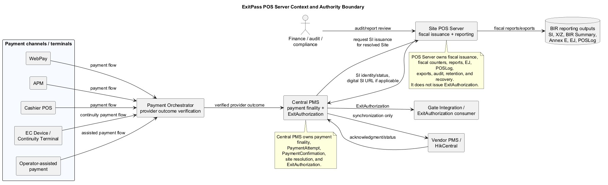
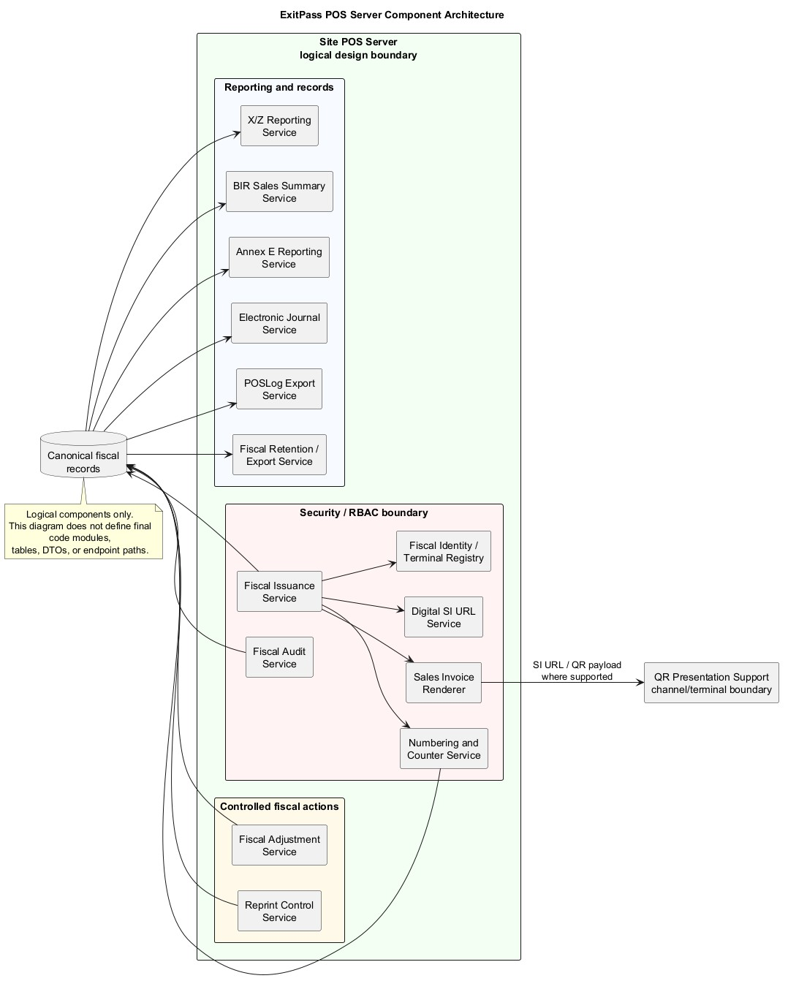
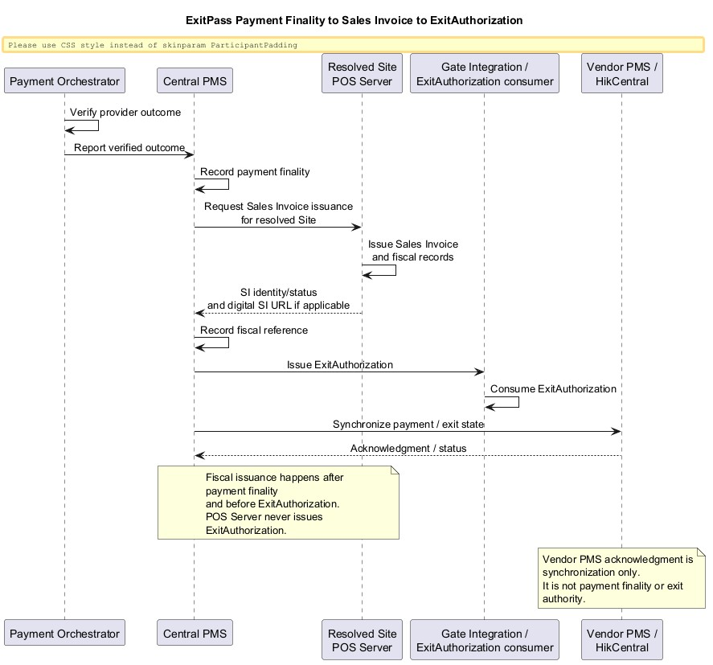
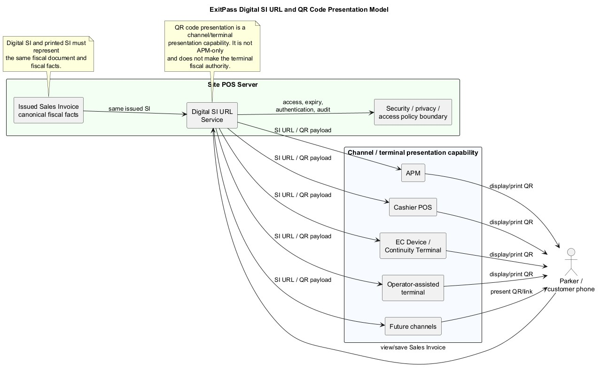
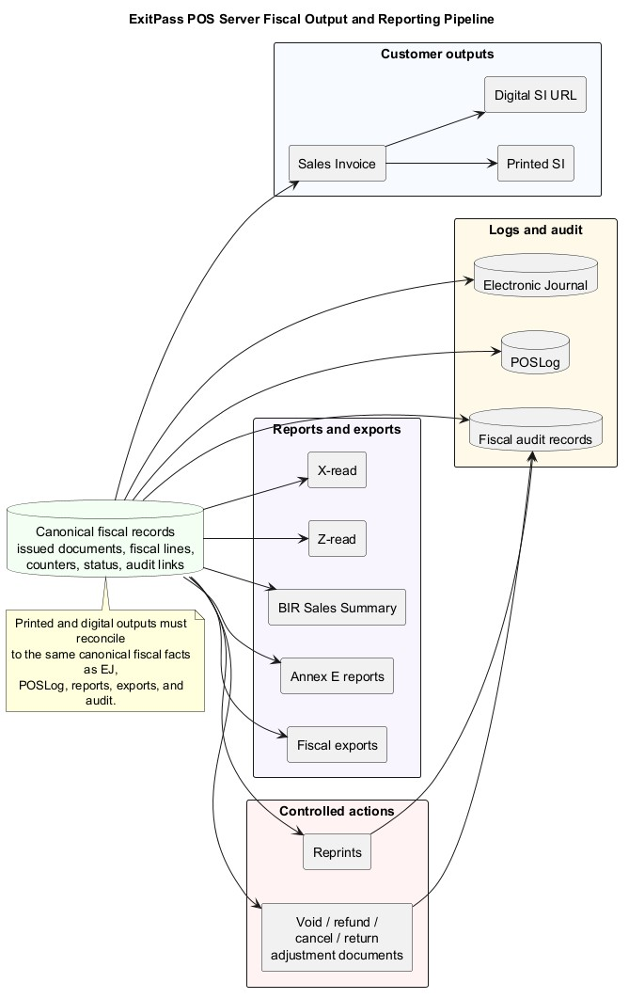
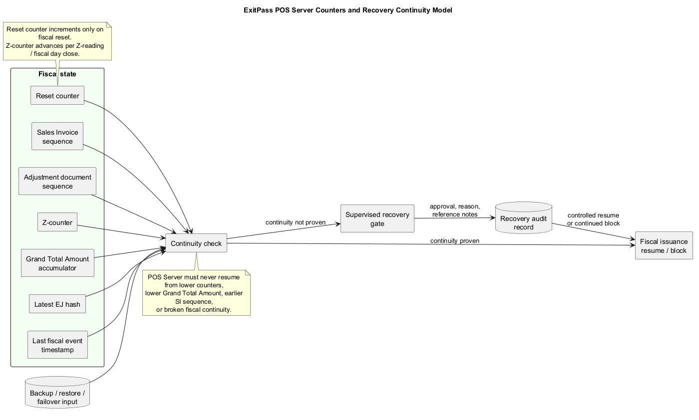
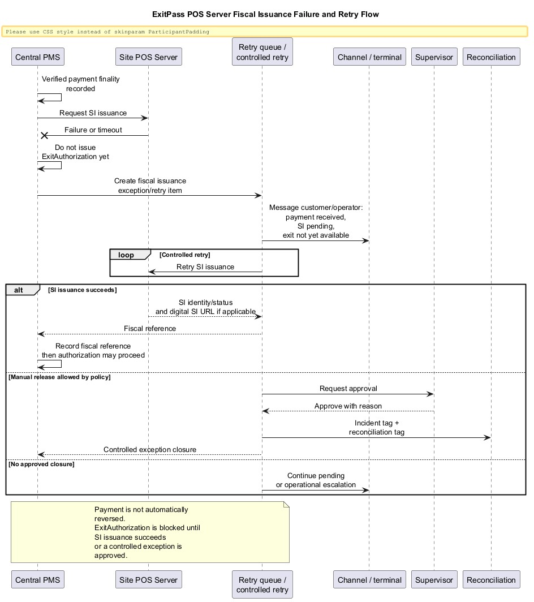

# ExitPass POS Server System Design v1.0

## 1. Document Control

| Field | Value |
| --- | --- |
| Document title | ExitPass POS Server System Design |
| Version | v1.0 Markdown draft |
| Product scope | ExitPass v1.3 POS Server |
| Status | Approved baseline |
| Generated | 2026-06-25 |
| Output format | Markdown only |
| BRD baseline | `docs/v1.3/pos-invoicing/ExitPass_POS_Invoicing_BRD_v1.0.md` |
| Approval note | `ExitPass_POS_Server_System_Design_v1.0.md` is approved as the POS Server System Design baseline for ExitPass v1.3 documentation and downstream POS Server API Contract, POS Server Database Design, Engineering Pack, BIR/accreditation confirmation package, and implementation planning. |

## 2. Purpose and Scope

This document defines the first technical design draft for the ExitPass Site-level POS Server. It is the companion technical design for the approved POS/Invoicing BRD v1.0 and translates approved business requirements into controlled technical architecture.

The design covers:

- Site-level POS Server boundary and authority model.
- Logical POS Server components.
- Sales Invoice issuance lifecycle.
- Printed and digital Sales Invoice delivery.
- Digital Sales Invoice URL and QR code presentation model.
- Fiscal numbering, counters, reporting, EJ, POSLog, exports, audit, reprints, adjustments, retention, and recovery continuity.
- Integration impact for Central PMS, Payment Orchestrator, WebPay, APM, Cashier POS, EC Device / Continuity Terminal, operator-assisted payment, and future channels.
- Database, API, eventing, security, privacy, testing, and certification impacts at design-planning level.

This document does not define final database tables, columns, indexes, migrations, API endpoint paths, DTOs, event schemas, or implementation internals. Those belong to follow-up POS Server Database Design, POS Server API Contract, API Contract Pack, and Engineering Pack tasks.

## 3. Reference Baseline

| Reference | Role in this design |
| --- | --- |
| `ExitPass_POS_Invoicing_BRD_v1.0.md` | Approved business requirements baseline and authority model. |
| POS Server System Design planning artifacts | Source analysis, decision log, open questions, impact map, outline, and diagram index. |
| POS/Invoicing planning artifacts | Prior decision history, recommendations, open questions, and impact analysis. |
| ExitPass v1.2 BRD/System Design/Database/API/Engineering Pack | Baseline platform authority, payment finality, ExitAuthorization, session, site, vendor, and integration concepts. |
| RMO No. 24-2023 and Annex D/E/F/G references | Fiscal output, X-read, Z-read, sales summary, statutory sales book, evaluation checklist, and meeting guidance. |
| Hikvision APM gap analysis and developer checklist | APM printing, POSLog/EJ/export, BIR accreditation gaps, and terminal constraints. |
| BIR RMO No. 10-2019 | Diplomat VAT Privilege / VAT Exemption requirements and open evidence/reporting questions. |

## 4. Architecture Principles

| ID | Principle | Design rule |
| --- | --- | --- |
| AP-001 | Preserve approved BRD authority model | The design shall not move payment finality or ExitAuthorization authority into POS Server, Payment Orchestrator, WebPay, APM, or any terminal. |
| AP-002 | Site-level fiscal boundary | The resolved Site determines the Site POS Server that issues the Sales Invoice. |
| AP-003 | Channel-neutral fiscal issuance | WebPay, APM, Cashier POS, EC/continuity, operator-assisted, and future channels shall be children of the Site POS Server, not independent POS systems. |
| AP-004 | Canonical fiscal facts | Printed SI, digital SI, EJ, POSLog, X/Z, BIR Sales Summary, Annex E, exports, and audit records shall derive from reconcilable canonical fiscal records. |
| AP-005 | Fiscal issuance before exit | Central PMS shall not issue ExitAuthorization until POS Server successfully returns fiscal document identity/status, unless a controlled exception policy allows manual release. |
| AP-006 | Open decisions remain visible | The design shall mark unresolved compliance/accounting/security/privacy decisions explicitly and shall not silently decide them. |
| AP-007 | Tamper-evident continuity | POS Server fiscal state shall never resume from lower counters, lower Grand Total Amount, earlier SI sequence, broken EJ hash continuity, or earlier last fiscal event timestamp. |

## 5. POS Server Context

The Site POS Server is the Site-level fiscal authority for parking Sales Invoice issuance and fiscal reporting. It is not a payment provider, a parking session authority, a tariff authority by itself, or an ExitAuthorization issuer.

The POS Server receives a fiscal issuance request only after Central PMS has verified payment finality. It issues the Sales Invoice for the resolved Site, records canonical fiscal facts, returns fiscal document identity/status and digital SI URL if applicable, and supports fiscal reports, logs, exports, audit, reprints, adjustments, counters, retention, and recovery.

See Diagram PSD-D01 in Section 43 for the context and authority boundary.

## 6. Site-level POS Server Boundary

Each Site or parking operation boundary shall have one Site-level POS Server for fiscal authority.

The Site POS Server boundary includes:

- Sales Invoice issuance.
- Fiscal document identity and numbering.
- Fiscal line classification.
- Printed and digital SI rendering basis.
- Digital SI URL production.
- Reset counter, Z-counter, Grand Total Amount accumulator, SI sequence, adjustment sequence, latest EJ hash, and last fiscal event timestamp.
- X-read, Z-read, BIR Sales Summary, Annex E reports, EJ, POSLog, exports, audit records.
- Reprint and fiscal adjustment controls.
- Fiscal retention and recovery continuity.
- Terminal/channel registration and fiscal identity metadata.

The boundary excludes:

- Parking session authority.
- Site resolution authority, except consuming the resolved Site from Central PMS.
- Payment provider outcome verification.
- Platform payment finality.
- ExitAuthorization creation or gate release authority.

Open for BIR/accounting confirmation: exact mapping between ExitPass Site, taxpayer branch/location, POS Server fiscal identity, and BIR-registered operation boundary.

## 7. Authority Model

| Authority area | Owner | POS Server design rule |
| --- | --- | --- |
| Parking session control state | Central PMS | POS Server consumes session reference/context only. |
| Site resolution | Central PMS | POS Server uses the resolved Site supplied or referenced by Central PMS. |
| PaymentAttempt | Central PMS | POS Server does not create or finalize PaymentAttempt. |
| PaymentConfirmation | Central PMS | POS Server consumes verified finality context. |
| Payment finality | Central PMS | Payment Orchestrator and WebPay do not declare platform finality. |
| ExitAuthorization | Central PMS | POS Server shall not issue ExitAuthorization. |
| Gate/exit execution | Central PMS authorization chain | Gate execution shall not bypass Central PMS. |
| Sales Invoice issuance | Site POS Server | POS Server issues SI only for the resolved Site. |
| Fiscal reports/counters/logs | Site POS Server | POS Server owns fiscal records, counters, reports, EJ, POSLog, exports, and audit. |
| Refund/reversal payment finality | Central PMS/payment provider | POS Server owns related fiscal adjustment documents, not money movement finality. |

## 8. Component Architecture

The following are logical design components, not final code modules or database schemas.

| Logical component | Responsibility |
| --- | --- |
| Fiscal Issuance Service | Coordinates SI issuance, validates issuance eligibility, applies idempotency, coordinates numbering, creates canonical fiscal records, and returns fiscal identity/status. |
| Sales Invoice Renderer | Produces approved printed and digital SI representations from canonical fiscal facts. |
| Digital SI URL Service | Creates and manages digital SI URL access according to security, privacy, retention, expiry, and audit policy. POS Server returns only the digital SI URL for QR presentation; it does not become the QR renderer. Open for Security/Privacy Review and POS Server API Contract. |
| QR Presentation Support boundary | Defines the channel/terminal presentation responsibility for converting the POS Server-returned digital SI URL into a QR code where supported. The channel/terminal performs QR generation, display, or print; this boundary does not make the terminal fiscal authority. |
| Numbering and Counter Service | Manages SI sequence, adjustment sequence, reset counter, Z-counter, Grand Total Amount accumulator, and related audit snapshots. |
| X/Z Reporting Service | Produces X-read and Z-read for approved fiscal scopes. Open for BIR/accounting confirmation on scope. |
| BIR Sales Summary Service | Produces required sales summary report from canonical fiscal facts. |
| Annex E Reporting Service | Produces statutory sales book/report structures for Senior, PWD, NAAC, Solo Parent, and applicable VAT privilege/exemption categories. |
| Electronic Journal Service | Maintains EJ records sufficient to reconstruct fiscal documents and required reports. |
| POSLog Export Service | Produces structured POSLog exports with an ARTS POSLog 6.x-aligned posture where practical and where accepted by BIR/accreditation requirements, while preserving BIR terminology and local BIR-specific fields. Open for BIR/accounting confirmation. |
| Fiscal Adjustment Service | Controls void/refund/cancel/return fiscal adjustment document lifecycle and reconciliation linkage. |
| Reprint Control Service | Controls Sales Invoice, X-read, Z-read, and Electronic Journal reprints where applicable, labels repeated output where required, and audits reprint activity. |
| Fiscal Audit Service | Records fiscal actions, privileged actions, configuration changes, recovery actions, URL access events where required, and export activity. |
| Fiscal Retention/Export Service | Applies confirmed fiscal retention and export policies. |
| Fiscal Identity / Terminal Registry | Manages Site POS Server, channel, terminal, software, supplier, MIN/PTU/serial, and accreditation metadata once confirmed. |
| Security/RBAC boundary | Enforces role separation and high-risk fiscal action approvals. |

See Diagram PSD-D02 in Section 43 for the logical component architecture.

## 9. Channel and Terminal Registration

The design shall model each payment channel or terminal as a child of the Site POS Server.

Supported channel/terminal types:

- WebPay.
- AutoPay Machine / APM.
- Cashier POS.
- EC Device / Continuity Terminal.
- Operator-assisted payment terminal or workflow if allowed.
- Future channels.

The registration model shall support:

- Resolved Site association.
- Channel/terminal type.
- Channel/terminal identity.
- Fiscal identity metadata where applicable.
- Operator/cashier/session accountability where applicable.
- Supported presentation capabilities such as print, display, digital SI URL, and QR presentation.
- Active/inactive and continuity/degraded operation state.
- Audit of registration and configuration changes.

Open for POS Server Database Design: final storage shape for channel/terminal registry.

Open for POS Server API Contract: final registration, lookup, and status contract shape.

## 10. Fiscal Identity Model

POS Server shall support rendering all BIR-required Sales Invoice identity, header, and footer metadata once assignment is confirmed.

The fiscal identity model shall support, at minimum:

- Taxpayer / registered business name.
- Registered address.
- TIN and VAT/non-VAT classification.
- Site or branch/location identity.
- Site POS Server fiscal identity.
- Terminal/channel identity where applicable.
- MIN.
- PTU or ATG details if applicable.
- Serial number.
- Terminal number.
- Software name and version.
- Supplier accreditation metadata.
- Required BIR footer text.
- Required non-input-tax warning where applicable.

Open for BIR/accounting confirmation: how these fields are assigned between Site POS Server, APM, Cashier POS, EC Device / Continuity Terminal, WebPay, operator-assisted channel, and future channels.

Open for supplier/applicant confirmation: responsible software supplier/applicant, POS user/PTU applicant, and vendor responsibility split.

## 11. Sales Invoice Lifecycle

The Sales Invoice lifecycle shall follow the approved authority sequence:

1. Payment Orchestrator verifies provider outcome.
2. Payment Orchestrator reports verified outcome to Central PMS.
3. Central PMS records payment finality.
4. Central PMS requests Sales Invoice issuance from the resolved Site POS Server.
5. POS Server validates issuance eligibility.
6. POS Server applies idempotent issuance behavior for the request.
7. POS Server applies fiscal identity metadata.
8. POS Server assigns or confirms Sales Invoice number according to confirmed numbering policy.
9. POS Server creates canonical fiscal record and fiscal lines.
10. POS Server renders printed SI representation as applicable.
11. POS Server creates digital SI URL as applicable.
12. POS Server records EJ, POSLog, audit, and related fiscal state.
13. POS Server returns SI identity/status and digital SI URL if applicable to Central PMS.
14. Central PMS records fiscal reference.
15. Central PMS issues ExitAuthorization.
16. Channel/terminal presents printed SI, digital SI URL, QR code, and payment/exit status according to capability and policy.

Idempotent issuance behavior shall prevent duplicate fiscal documents for retried issuance requests. The final strategy for sequence reservation, failed attempts, abandoned issuance, and gaps is open for BIR/accounting confirmation and POS Server API Contract.

Central PMS integration, eventing/outbox design, and POS Server API Contract shall explicitly account for idempotent SI issuance and retry semantics so that retries, timeouts, and sequence-gap cases do not create duplicate fiscal documents or silently skip required fiscal audit records. See Sections 14, 30, 31, 38, 40, and Open Question `PSD-OQ-018`.

Reprints and repeated digital access shall not mutate the original fiscal document or fiscal event. They shall be controlled and audited where required.

See Diagram PSD-D03 in Section 43.

## 12. Printed and Digital Sales Invoice Delivery

POS Server shall support printed and digital Sales Invoice presentation where the channel supports both.

Printed SI:

- Shall be rendered from canonical fiscal facts.
- Should be simplified and BIR-acceptable.
- Shall not force long technical payloads into printed output.
- Shall preserve required identity/header/footer fields once confirmed.

Digital SI:

- Shall point to the same issued Sales Invoice as the printed SI.
- Shall allow the parker/customer to view and save the Sales Invoice on their phone.
- Shall be generated or made available by the POS Server after SI issuance.
- Shall not represent different fiscal facts from printed SI.

The implementation shall not allow printed and digital forms to diverge in fiscal document identity, totals, fiscal line basis, tax treatment, customer-facing fiscal facts, or issuance status.

Open for Security/Privacy Review: final digital SI access policy, expiry policy, authentication/access model, and audit treatment.

## 13. Digital SI URL and QR Code Model

POS Server shall return the digital Sales Invoice URL after successful SI issuance where digital delivery is enabled.

Design rules:

- The SI URL points to the same issued Sales Invoice as the printed SI.
- The SI URL shall not allow unauthorized modification of the Sales Invoice.
- The SI URL shall not expose unnecessary sensitive data.
- Access to the SI URL shall be governed by security, privacy, retention, and anti-tampering controls.
- Repeated digital access shall be auditable where required.
- The URL access policy, expiry policy, authentication/access model, and audit treatment are open for Security/Privacy Review and POS Server API Contract.

QR code presentation:

- QR code presentation is a channel/terminal display or print capability.
- QR code presentation is not APM-only.
- APM, Cashier POS, EC Device / Continuity Terminal, operator-assisted terminals, and future channels may present the QR where supported.
- POS Server owns digital SI URL generation and returns only the digital SI URL for QR presentation.
- The channel or terminal converts the POS Server-returned URL into a QR code where QR presentation is supported.
- QR generation, display, and printing are channel/terminal presentation responsibilities.
- QR presentation does not make the terminal/channel the fiscal issuer.
- Site POS Server remains the fiscal issuer.

Open for POS Server API Contract: final contract for returning the digital SI URL and for channel/terminal receipt of that URL.

Open for implementation planning: whether non-APM QR presentation is mandatory for specific assisted channels.

See Diagram PSD-D04 in Section 43.

## 14. Fiscal Document Numbering

The design must support:

- Sales Invoice sequence.
- Adjustment document sequence or sequences.
- Reset counter.
- Z-counter.
- Grand Total Amount accumulator.
- Latest EJ hash.
- Last fiscal event timestamp.

Sales Invoice numbering pattern is open for BIR/accounting confirmation.

Adjustment document numbering pattern is open for BIR/accounting confirmation.

Reset counter print/append behavior is open for BIR/accounting confirmation.

Proposed design posture:

- Store sequence state separately from print/rendering format.
- Keep reset counter separate from Z-counter.
- Keep sequence generation auditable and tied to canonical fiscal records.
- Support idempotent issuance and controlled retry without duplicate fiscal documents.
- Do not finalize sequence gap behavior until BIR/accounting confirms reserved, failed, voided, abandoned, or skipped number treatment.
- Align numbering, sequence-gap, retry, and idempotency handling with Central PMS integration, eventing/outbox, and POS Server API Contract design. See Sections 30, 31, 38, 40, and Open Question `PSD-OQ-018`.

## 15. Fiscal Line Model

POS Server shall support explicit fiscal line classification independent of tariff snapshots alone.

The fiscal line model shall support:

- VATable sales.
- VAT-exempt sales.
- Zero-rated sales.
- Non-VAT sales.
- Statutory discounts.
- VAT privileges / VAT exemptions.
- Coupons.
- Penalties.
- Lost ticket fees.
- Overstay charges.
- Service charges.
- Other fiscal adjustments.

The model shall allow fiscal reports, Sales Invoice rendering, EJ, POSLog, exports, and audit records to reconcile from the same canonical fiscal line facts.

Open for BIR/accounting confirmation: exact VAT/tax treatment per taxpayer, Site, transaction type, entitlement type, and line item.

## 16. Entitlement and VAT Privilege Handling

Immediate operational entitlement workflows:

- Senior Citizen.
- PWD.

Future-supported statutory entitlement categories:

- NAAC.
- Solo Parent.

Active VAT privilege / VAT exemption category:

- Diplomat VAT Privilege / VAT Exemption under BIR RMO No. 10-2019.

Design rules:

- Senior and PWD shall be supported in fiscal line, SI, BIR Sales Summary, Annex E, EJ, POSLog, export, and audit model.
- NAAC and Solo Parent shall be represented in extensible report structures even if workflows are future-supported.
- Diplomat VAT Privilege / VAT Exemption shall not be modeled as an ordinary commercial discount.
- Diplomat treatment shall be modeled as VAT privilege / VAT exemption capability.

Open for BIR/accounting confirmation:

- Diplomat VAT treatment.
- Required supporting document.
- Buyer/customer identity fields.
- Whole-transaction vs fiscal-line applicability.
- SI wording.
- BIR Sales Summary treatment.
- EJ/POSLog treatment.
- Evidence retention.
- Reporting requirements.

Open for Security/Privacy Review: evidence data storage/reference model and retention.

## 17. X-read and Z-read

POS Server shall support X-read and Z-read generation from canonical fiscal records.

X-read design rules:

- X-read shall be producible for BIR/accounting-approved operational scopes.
- Potential scopes include cashier/session, terminal/channel, Site POS Server, or combined Site + terminal + cashier/session model.
- X-read shall not close the fiscal day unless confirmed otherwise by BIR/accounting.

Z-read design rules:

- Z-read shall close the applicable fiscal day for the approved fiscal scope.
- Z-read shall advance the Z-counter.
- Z-read shall not advance the reset counter.
- Z-read shall reconcile to Sales Invoice sequence, fiscal totals, Grand Total Amount, EJ, POSLog, BIR Sales Summary, and audit records as applicable.

Open for BIR/accounting confirmation: final X-read and Z-read scope and aggregation model.

## 18. Reset Counter, Z-counter, and Grand Total Amount

The design shall clearly distinguish:

| Fiscal state | Rule |
| --- | --- |
| Sales Invoice sequence | Advances according to confirmed SI numbering policy. |
| Adjustment document sequence | Advances according to confirmed adjustment numbering policy. |
| Reset counter | Starts from zero and increments only on fiscal reset. |
| Z-counter | Advances per Z-reading / fiscal day close. |
| Grand Total Amount accumulator | Preserved as fiscal continuity reference. |
| Latest EJ hash | Preserved as continuity and tamper-evidence reference. |
| Last fiscal event timestamp | Preserved as continuity and audit reference. |

Reset counter shall not advance per Z-read.

When a fiscal reset occurs, POS Server shall preserve:

- Previous Grand Total Amount.
- Previous reset counter.
- Reset timestamp.
- Reset reason.
- Approving user.
- Recovery/reference notes.

Open for BIR/accounting confirmation: whether reset counter is printed separately, appended to fiscal document number, or both.

See Diagram PSD-D06 in Section 43.

## 19. BIR Sales Summary and Annex E Reporting

BIR Sales Summary is a first-class required fiscal report, not optional analytics.

The BIR Sales Summary Service shall reconcile to:

- Sales Invoice sequence.
- Z-counter.
- Reset counter.
- Grand Total Amount.
- VAT and deductions.
- Fiscal totals.
- EJ.
- POSLog.
- Fiscal audit records.

Annex E Reporting Service shall support:

- Annex E-1 BIR Sales Summary.
- Annex E-2 Senior Citizen report requirements.
- Annex E-3 PWD report requirements.
- Annex E-4 NAAC report structures.
- Annex E-5 Solo Parent report structures.
- Extensible VAT privilege / VAT exemption treatment, including Diplomat VAT Privilege / VAT Exemption after confirmation.

Open for BIR/accounting confirmation: whether NAAC and Solo Parent structures must be active in v1.3 even if workflows remain future-supported.

## 20. Electronic Journal

Electronic Journal Service shall maintain fiscal records sufficient to reconstruct fiscal documents and required fiscal reports.

Design rules:

- EJ shall reconcile to canonical fiscal records.
- EJ shall support SI, reprints, X-read, Z-read, adjustments, and report reconstruction as required.
- EJ shall support confirmed export/replica format.
- EJ shall contribute to tamper-evident continuity through latest EJ hash or equivalent continuity reference.

Open for BIR/accounting confirmation: exact EJ format, text replica requirements, export requirements, and relationship to POSLog.

## 21. POSLog

POSLog Export Service shall produce structured fiscal transaction logs aligned to the approved fiscal event model.

Design rules:

- POSLog shall not diverge from EJ or canonical fiscal records.
- POSLog exports should use an ARTS POSLog 6.x-aligned export posture where practical and where accepted by BIR/accreditation requirements.
- ARTS POSLog is a structured export and schema interoperability reference; it does not replace Philippine BIR fiscal document and report requirements.
- POSLog shall preserve ExitPass and BIR terminology, including Sales Invoice, SI, and Sales Invoice Number.
- POSLog shall coexist with BIR-required outputs including Sales Invoice, X-read, Z-read, EJ, POSLog, and BIR Sales Summary.
- Local and BIR-specific fields may be represented as local extensions or mapped fields where needed.
- POSLog local/BIR field support should include Sales Invoice Number, Ticket Number / Plate Number, Site / branch / business unit identity, channel / terminal / workstation identity, Business Day Date, MIN, PTU, Serial Number, supplier/accreditation metadata, Reset Counter, Z Counter, Grand Total Amount, Digital SI URL, parking session timestamps and duration, and fiscal audit references.
- POSLog shall include fiscal events needed for SI, fiscal lines, reprints, adjustments, X/Z, reports, exports, and audit.

Open for BIR/accounting confirmation: mandatory POSLog format, exact ARTS POSLog profile, local extension mapping, and reconciliation expectations when EJ is text-oriented and POSLog is structured.

## 22. Fiscal Exports

Fiscal Retention/Export Service shall support confirmed export outputs for:

- Sales Invoice.
- EJ.
- POSLog.
- X-read.
- Z-read.
- BIR Sales Summary.
- Annex E reports.
- Fiscal audit records.
- Reprint records.
- Adjustment documents.

Candidate export formats include TXT, PDF, JSON, XML, and ARTS POSLog, but exact mandatory formats remain open for BIR/accounting confirmation.

The implementation shall not treat export files as independent fiscal truth. Exports shall be generated from canonical fiscal records and shall remain reconcilable to EJ, POSLog, reports, and audit.

Structured fiscal export posture:

- JSON fiscal and audit records should remain complete even when printed outputs are simplified.
- JSON and POSLog exports should be schema-versioned.
- JSON and POSLog exports should support validation against approved BIR/ARTS-aligned schemas where applicable.
- Validation failures should be auditable and visible to operational/support workflows.

Open for Engineering Pack and POS Server Database Design: exact schema versioning, validation jobs, packaging, storage, and repair workflows.

## 23. Reprints

Reprint Control Service shall support controlled reprints of fiscal outputs as required.

Design rules:

- Controlled reprint coverage shall include Sales Invoice, X-read, Z-read, and Electronic Journal outputs where applicable.
- Reprints shall not mutate original fiscal document facts.
- Reprinted fiscal outputs shall show `REPRINT` and `DATE / TIME REPRINTED` at the bottom of the reprinted output where BIR requires them.
- Reprints shall be controlled, authorized where required, and audited.
- Reprints shall reference the original fiscal document.
- Reprint permissions shall be governed by RBAC and audit policy.
- Repeated digital access shall follow the same non-mutation principle and shall be audited where required.

Open for BIR/accounting confirmation: output-specific reprint layout rules and any channel-specific exceptions.

## 24. Void/Refund/Cancel/Return Adjustment Documents

Fiscal Adjustment Service shall support controlled fiscal adjustment workflows for void, refund, cancel, return, and related fiscal documents as required by BIR/accounting.

Design rules:

- Fiscal adjustment documents shall reference the original Sales Invoice or fiscal document.
- Adjustment actions shall be restricted, reason-coded, auditable, and linked to payment/refund/reversal evidence where applicable.
- POS Server owns fiscal adjustment document creation.
- Central PMS/payment provider owns payment refund/reversal finality.
- Adjustment values and warnings shall be represented according to BIR/accounting confirmation.

Open for BIR/accounting confirmation: final document types, titles, numbering, value presentation, warnings, and sequencing.

Open for POS Server API Contract: coordination contract between Central PMS/payment flows and POS Server fiscal adjustment workflows.

## 25. Fiscal Audit Trail

Fiscal Audit Service shall record audit events for:

- SI issuance.
- Digital SI URL creation/access where required.
- QR presentation-related URL delivery or presentation activity where required.
- Reprints.
- Void/refund/cancel/return fiscal adjustments.
- X-read and Z-read.
- BIR Sales Summary and Annex E generation.
- EJ/POSLog/export generation.
- Fiscal reset.
- Counter changes.
- Terminal/channel registration and configuration.
- Fiscal identity changes.
- RBAC/approval decisions.
- Recovery, restore, failover, continuity checks, and supervised recovery.

Audit records shall be tamper-evident from a control perspective and retained according to confirmed fiscal retention policy.

## 26. Security, RBAC, and Segregation of Duties

The design shall enforce role-based controls for fiscal actions.

Expected role separation:

- Cashier.
- Supervisor.
- Fiscal administrator.
- Compliance auditor.
- Recovery/DR approver.
- System administrator.

High-risk actions requiring authorization and audit include:

- Z-close.
- Fiscal reset.
- Reprint.
- Void/refund/cancel/return.
- Export.
- Fiscal configuration changes.
- Fiscal identity changes.
- Terminal/channel registration changes.
- Digital SI URL policy changes.
- Recovery/restore actions.

Open for Security/Privacy Review and implementation planning: final permission matrix, approval workflow, and privileged access monitoring.

## 27. Privacy and Evidence Handling

The design shall minimize personal and sensitive data while supporting fiscal and compliance reporting.

Privacy design rules:

- Store only fiscal, entitlement, and evidence data required for approved business, compliance, and BIR purposes.
- Prefer evidence references over duplicating sensitive evidence where feasible.
- Restrict evidence access to authorized roles.
- Audit evidence access.
- Separate fiscal retention from evidence retention where policy differs.
- Do not expose unnecessary sensitive data through digital SI URL.

Diplomat VAT Privilege / VAT Exemption evidence may include BIR-issued VAT Certificate, VAT Identification Card, DFA/BIR-issued documentation, or other approved supporting evidence.

Open for Security/Privacy Review: digital SI URL access model, expiry, authentication/access model, audit treatment, evidence storage/reference model, and retention.

## 28. Fiscal State Integrity and Tamper Evidence

POS Server fiscal state shall be tamper-evident and append-only from a control perspective.

Fiscal continuity state shall include:

- Sales Invoice sequence.
- Adjustment document sequence.
- Reset counter.
- Z-counter.
- Grand Total Amount accumulator.
- Latest EJ hash.
- Last fiscal event timestamp.
- Last externally anchored fiscal state, if used.

The design shall prevent silent rollback, duplication, skipped records, and unauthorized mutation.

Open for POS Server Database Design: final persistence model for append-only fiscal state and audit records.

Open for Security/Privacy Review: final tamper-evidence and external anchoring mechanism.

## 29. Backup, Restore, Failover, and Recovery

POS Server must never resume fiscal issuance from:

- Lower fiscal counter.
- Lower Grand Total Amount.
- Lower Z-counter.
- Earlier Sales Invoice sequence.
- Broken EJ hash continuity.
- Earlier last fiscal event timestamp.

Recovery design rules:

- Restore/failover shall perform continuity check before fiscal issuance resumes.
- Continuity check shall compare restored state against last known/anchored fiscal state.
- If continuity can be proven, issuance may resume under audited recovery path.
- If continuity cannot be proven, fiscal issuance shall be blocked pending supervised recovery.
- Supervised recovery shall produce recovery audit record before issuance resumes or before controlled closure.

Open for POS Server Database Design and Security Review: final continuity proof, external anchoring, backup validation, and supervised recovery mechanism.

See Diagram PSD-D06 in Section 43.

## 30. Exception and Retry Handling

If SI issuance fails or times out after verified payment finality:

- Payment finality is not automatically reversed.
- Central PMS shall not issue ExitAuthorization yet.
- Case enters controlled fiscal issuance exception/retry workflow.
- Customer/operator messaging shall show payment received, fiscal issuance pending, and exit not yet available.
- Retry shall be controlled and idempotent.
- Manual release, if allowed, shall be supervisor-approved, incident-tagged, and reconciliation-tagged.
- POS Server still shall not issue ExitAuthorization.

Offline fiscal issuance is disabled or restricted by default until BIR/accounting approves a compliant model. APM, Cashier POS, EC Device / Continuity Terminal, and operator-assisted workflows must not create offline fiscal documents unless the approved model defines sequence, counter, evidence, reconciliation, and recovery controls.

Central PMS integration, eventing/outbox, and POS Server API Contract shall account for retry idempotency, failed issuance, abandoned issuance, reserved numbers, and sequence-gap treatment without defining final endpoint paths, DTOs, database tables, or status codes in this document.

Open for POS Server API Contract: final status model, retry contract, idempotency key/identity concept, and exception closure contract.

Open for BIR/accounting confirmation: sequence-gap, reserved-number, failed-issuance, abandoned-issuance, and offline fiscal issuance treatment.

Open for implementation: final retry queue/worker mechanism.

See Diagram PSD-D07 in Section 43.

## 31. Integration With Central PMS

Central PMS is the primary integration partner for fiscal issuance.

Central PMS shall:

- Own site resolution.
- Own payment finality.
- Request SI issuance after verified payment finality.
- Provide or reference resolved Site, parking session, payment confirmation, channel/terminal, and fiscal context.
- Record POS Server fiscal identity/status and digital SI URL if applicable.
- Withhold ExitAuthorization until fiscal issuance succeeds or controlled exception policy allows release.
- Issue ExitAuthorization after fiscal reference is recorded.

POS Server shall:

- Validate issuance request against resolved Site and fiscal state.
- Issue Sales Invoice for the resolved Site.
- Return fiscal document identity/status and digital SI URL if applicable.
- Return failure/timeout/error status without granting exit authority.

Open for POS Server API Contract: final request/response shape and status model.

Open for POS Server API Contract: issuance idempotency identity, retry behavior, duplicate-request handling, timeout handling, and sequence-gap treatment. See Section 40 and Open Question `PSD-OQ-018`.

## 32. Integration With Payment Orchestrator

Payment Orchestrator shall verify provider outcome and report verified outcome to Central PMS.

Payment Orchestrator shall not:

- Declare platform payment finality.
- Request POS Server issuance as payment finality authority.
- Bypass Central PMS fiscal issuance choreography.
- Issue ExitAuthorization.

Design impact:

- Payment Orchestrator may contribute provider outcome metadata indirectly through Central PMS context.
- Payment Orchestrator events may be reconciled to POS Server fiscal records through Central PMS payment confirmation references.

## 33. Integration With WebPay

WebPay shall route fiscal issuance through Central PMS and the resolved Site POS Server.

WebPay shall:

- Display/provide access to issued Sales Invoice after POS Server issuance.
- Support digital SI presentation using POS Server-returned URL where approved.
- Preserve Central PMS payment finality and ExitAuthorization authority.

WebPay shall not:

- Declare platform payment finality.
- Issue ExitAuthorization.
- Act as independent POS system.

Open for BIR/accounting confirmation: WebPay fiscal terminal identity where no physical printer or hardware serial exists.

Open for POS Server API Contract: WebPay receipt of the digital SI URL.

## 34. Integration With APM

APM shall be modeled as child terminal/channel under the Site POS Server.

APM shall:

- Route fiscal issuance to resolved Site POS Server.
- Present or print POS Server-issued SI according to approved printing model.
- Convert the POS Server-returned digital SI URL into a QR code and display or print that QR code where supported.
- Preserve Central PMS payment finality and ExitAuthorization authority.

APM shall not:

- Become independent fiscal authority for the Site.
- Issue ExitAuthorization.
- Bypass Central PMS.

Open for BIR/accounting and Hikvision/APM vendor confirmation: whether APM prints POS Server-issued payload or requires another approved printing arrangement.

## 35. Integration With Cashier POS

Cashier POS shall be modeled as child terminal/channel under the Site POS Server.

Cashier POS shall support:

- Fiscal issuance through Site POS Server.
- Cashier/session accountability.
- Controlled reprints and adjustment actions for authorized roles.
- Printed SI presentation where applicable.
- Digital SI URL presentation and channel-side QR generation/display/print where supported.
- Fiscal status and exception messaging.

Cashier POS shall not independently declare payment finality outside Central PMS authority.

Open for POS Server API Contract: cashier/session context and digital SI URL receipt contract.

## 36. Integration With EC Device / Continuity Terminal

EC Device / Continuity Terminal shall use the same Site POS Server fiscal authority when activated.

Design rules:

- EC/continuity terminal is child terminal/channel under Site POS Server.
- Offline fiscal issuance remains restricted until BIR/accounting confirms approved model.
- Continuity mode shall preserve Central PMS payment finality and ExitAuthorization authority.
- Digital SI URL presentation and channel-side QR generation/display/print may be supported under the approved continuity model.
- Fiscal sequence and counter continuity must not be weakened by continuity mode.
- EC Device / Continuity Terminal, APM, Cashier POS, and operator-assisted workflows shall not create offline fiscal documents unless the approved model defines sequence, counter, evidence, reconciliation, and recovery controls.
- Degraded/continuity operation shall preserve Central PMS payment finality and ExitAuthorization authority.

Open for BIR/accounting confirmation: offline fiscal issuance allowance, sequence, counter, reconciliation, and evidence controls.

## 37. Integration With Operator-assisted Payment

Operator-assisted payment, if allowed, shall route fiscal issuance through resolved Site POS Server.

Operator-assisted flows shall:

- Preserve operator identity.
- Preserve Site context.
- Preserve reason/context where required.
- Support SI presentation, digital SI URL presentation, and operator-terminal QR generation/display/print where supported.
- Preserve Central PMS payment finality and ExitAuthorization authority.

Manual release after fiscal issuance failure, if allowed, shall require supervisor approval, incident tagging, and reconciliation tagging.

Open for implementation planning: operator terminal presentation rules and whether QR presentation is mandatory.

## 38. Eventing and Outbox Impact

The full design should identify fiscal events and outbox needs without finalizing schemas in this document.

Candidate events/records:

- SI issuance requested.
- SI issued.
- SI issuance failed/timed out.
- Digital SI URL created.
- Digital SI accessed where required.
- Reprint requested/completed.
- Adjustment requested/issued.
- X-read generated.
- Z-read generated.
- BIR Summary generated.
- Annex E generated.
- EJ/POSLog/export generated.
- Fiscal reset requested/approved/completed.
- Terminal/channel registered/updated.
- Fiscal identity changed.
- Recovery continuity check passed/failed.
- Supervised recovery approved/completed.

Open for API Contract Pack and Engineering Pack: final event names, payloads, delivery guarantees, outbox ownership, replay behavior, and retention.

Eventing and outbox design shall explicitly account for idempotent SI issuance, retry semantics, failed issuance, abandoned issuance, reserved numbers, and sequence-gap auditability. These concerns shall be resolved with the POS Server API Contract and BIR/accounting confirmation; this document does not define final event schemas or payloads.

## 39. Database Design Impact

This document does not define final database tables, columns, indexes, constraints, or migrations.

Future Database Design v1.3 impact areas:

- Fiscal document records.
- Fiscal line records.
- SI and adjustment sequence state.
- Reset counter, Z-counter, Grand Total Amount, latest EJ hash, last fiscal event timestamp.
- Terminal/channel registry.
- Fiscal identity metadata.
- EJ records.
- POSLog records or export references.
- Report generation records.
- Export records.
- Reprint records.
- Adjustment records.
- Fiscal audit records.
- Digital SI URL access/audit records.
- Fiscal retention metadata.
- Recovery/continuity anchors.

Open for POS Server Database Design: final schema, constraints, indexes, partitioning, archival, retention, and migration approach.

## 40. API Contract Impact

This document does not define final API endpoint paths, DTOs, or schemas.

Future POS Server API Contract impact areas:

- SI issuance request/status response.
- Fiscal document lookup/status.
- Digital SI URL retrieval/presentation.
- Terminal/channel registration and status.
- Reprint request.
- Adjustment request/status.
- X-read/Z-read request/status.
- BIR Sales Summary and Annex E report request/export.
- EJ/POSLog/export request.
- Fiscal reset/recovery workflow.
- Exception/retry status.
- Fiscal identity configuration.

Open for POS Server API Contract: final endpoint paths, DTOs, status codes, idempotency model, authentication/authorization, error model, event model, and versioning.

The POS Server API Contract shall explicitly define retry and idempotency semantics for SI issuance, exception handling, fiscal document lookup/status, and Central PMS fiscal reference recording. It shall also define how sequence gaps, reserved numbers, failed issuance, and abandoned issuance are represented once BIR/accounting treatment is confirmed.

## 41. Observability and Operations

POS Server operations shall support visibility into:

- Fiscal issuance health.
- POS Server ONLINE/OFFLINE status where required.
- Pending issuance retries.
- Failed/timed-out issuance.
- Digital SI URL access health.
- Terminal/channel registration, availability, and ONLINE/OFFLINE or equivalent reachability/health state where applicable.
- X/Z close status.
- Report/export generation status.
- Counter and GTA continuity.
- EJ/POSLog generation health.
- Recovery/failover state.
- Fiscal audit activity.
- RBAC/approval events.

Operational alerts should be planned for:

- SI issuance failures.
- Issuance retry backlog.
- Counter continuity warnings.
- Failed recovery check.
- Export/report failures.
- Digital SI URL access failures.
- Unauthorized or anomalous fiscal action attempts.

ONLINE/OFFLINE indicator rules:

- ONLINE/OFFLINE status is operational and observability information.
- ONLINE/OFFLINE status does not approve offline fiscal issuance.
- Offline fiscal issuance remains disabled or restricted unless BIR/accounting approves a compliant sequence, counter, evidence, reconciliation, and recovery model.

Open for Engineering Pack: final metrics, logs, dashboards, alerts, runbooks, and operational SLOs.

## 42. Testing and Certification Considerations

Testing should include:

- Payment finality to SI to ExitAuthorization happy path.
- SI issuance failure and retry.
- No ExitAuthorization when SI issuance fails.
- WebPay, APM, Cashier POS, EC/continuity, operator-assisted, and future channel routing.
- Printed and digital SI consistency.
- Digital SI URL access, expiry, privacy, and audit behavior.
- QR presentation by APM and supported assisted channels.
- X-read and Z-read generation.
- Reset counter vs Z-counter behavior.
- Grand Total Amount continuity.
- BIR Sales Summary and Annex E reports.
- Senior/PWD entitlement flows.
- NAAC/Solo Parent report structure support.
- Diplomat VAT Privilege / VAT Exemption once treatment is confirmed.
- EJ/POSLog reconciliation.
- Fiscal exports.
- Reprints.
- Void/refund/cancel/return adjustments.
- RBAC and segregation of duties.
- Backup/restore/failover/recovery continuity.
- Accreditation sample package generation.

Open for BIR/accounting confirmation: final certification sample set and print/report/export layout signoff.

## 43. Diagrams

### PSD-D01 POS Server Context and Authority Boundary

Purpose: Shows POS Server relationships and the Central PMS/POS authority boundary.

PlantUML source: `diagrams/ExitPass_POS_Server_Context_Authority_Boundary.puml`

### PSD-D02 POS Server Component Architecture

Purpose: Shows logical POS Server components and their fiscal responsibilities.

PlantUML source: `diagrams/ExitPass_POS_Server_Component_Architecture.puml`

### PSD-D03 Payment Finality to SI to ExitAuthorization Sequence

Purpose: Shows the required sequence from verified payment finality through SI issuance to ExitAuthorization.

PlantUML source: `diagrams/ExitPass_POS_Server_Payment_Finality_to_SI_to_ExitAuthorization.puml`

### PSD-D04 Digital SI URL and QR Code Presentation Model

Purpose: Shows digital SI URL generation and QR presentation as a channel/terminal capability.

PlantUML source: `diagrams/ExitPass_Digital_SI_URL_QR_Presentation_Model.puml`

### PSD-D05 Fiscal Output and Reporting Pipeline

Purpose: Shows canonical fiscal records feeding print, digital SI, EJ, POSLog, reports, exports, audit, reprints, and adjustments.

PlantUML source: `diagrams/ExitPass_POS_Server_Fiscal_Output_Reporting_Pipeline.puml`

### PSD-D06 Fiscal Counters and Recovery Continuity Model

Purpose: Shows SI sequence, adjustment sequence, counters, GTA, EJ hash, last event timestamp, restore/failover, supervised recovery, and recovery audit.

PlantUML source: `diagrams/ExitPass_POS_Server_Counters_Recovery_Continuity_Model.puml`

### PSD-D07 Fiscal Issuance Failure and Retry Flow

Purpose: Shows fiscal issuance failure, retry, blocked authorization, messaging, supervisor-approved exception, incident/reconciliation tagging, and controlled closure.

PlantUML source: `diagrams/ExitPass_POS_Server_Fiscal_Issuance_Failure_Retry_Flow.puml`

## 44. Open Questions

| ID | Open question | Classification |
| --- | --- | --- |
| PSD-OQ-001 | What exact Sales Invoice numbering pattern is required? | Open for BIR/accounting confirmation; Open for POS Server API Contract; Open for POS Server Database Design |
| PSD-OQ-002 | What exact adjustment document numbering pattern is required? | Open for BIR/accounting confirmation; Open for POS Server API Contract; Open for POS Server Database Design |
| PSD-OQ-003 | Should reset counter print separately, append to fiscal number, or both? | Open for BIR/accounting confirmation |
| PSD-OQ-004 | How are MIN, PTU, serial, terminal number, software version, and supplier accreditation metadata assigned across Site POS Server and terminals/channels? | Open for BIR/accounting confirmation; Open for POS Server Database Design |
| PSD-OQ-005 | What fiscal terminal identity should WebPay use without physical printer or hardware serial? | Open for BIR/accounting confirmation |
| PSD-OQ-006 | Can APM print a POS Server-issued SI payload, or must APM be treated differently for print purposes? | Open for BIR/accounting confirmation; Open for vendor confirmation |
| PSD-OQ-007 | What X-read and Z-read scope is approved? | Open for BIR/accounting confirmation |
| PSD-OQ-008 | Is offline fiscal issuance allowed? | Open for BIR/accounting confirmation |
| PSD-OQ-009 | How should refund/void sequencing work between Central PMS/provider and POS Server fiscal adjustment? | Open for POS Server API Contract; Open for finance/compliance confirmation |
| PSD-OQ-010 | What exact VAT/tax treatment applies by Site, taxpayer, transaction type, entitlement, and line item? | Open for BIR/accounting confirmation |
| PSD-OQ-011 | What exact Diplomat VAT Privilege / VAT Exemption treatment, evidence, wording, reporting, and retention are required? | Open for BIR/accounting confirmation; Open for Security/Privacy Review |
| PSD-OQ-012 | Should NAAC and Solo Parent report structures be active in v1.3? | Open for BIR/accounting/product confirmation |
| PSD-OQ-013 | What mandatory export formats are required? | Open for BIR/accounting confirmation; Open for POS Server API Contract |
| PSD-OQ-014 | What is the final accreditation sample set? | Open for BIR/accounting confirmation |
| PSD-OQ-015 | Who is software supplier/applicant and POS user/PTU applicant? | Open for legal/compliance/vendor confirmation |
| PSD-OQ-016 | What Sales Invoice URL access policy, expiry policy, authentication/access model, and audit treatment are required? | Open for Security/Privacy Review; Open for POS Server API Contract; Open for POS Server Database Design |
| PSD-OQ-017 | Are QR code presentation rules mandatory for non-APM assisted channels? | Open for product/operations/security/compliance confirmation |
| PSD-OQ-018 | How should sequence gaps, reserved numbers, failed issuance, and retry idempotency be handled? | Open for BIR/accounting confirmation; Open for POS Server API Contract |
| PSD-OQ-019 | How should tamper-evident state and external anchoring be implemented? | Open for POS Server Database Design; Open for Security/Privacy Review |
| PSD-OQ-020 | What recovery procedure is approved after restore/failover/counter continuity failure? | Open for POS Server Database Design; Open for operations/compliance |
| PSD-OQ-021 | What fiscal roles and permissions are required? | Open for Security/Privacy Review |
| PSD-OQ-022 | What clock authority and time rollback controls are required? | Open for Security/Privacy Review; Open for Engineering Pack |
| PSD-OQ-023 | Where should entitlement/evidence data live for Annex E and Diplomat support? | Open for Security/Privacy Review; Open for POS Server Database Design |

## 45. Risks and Mitigations

| Risk | Impact | Mitigation |
| --- | --- | --- |
| POS Server scope becomes APM-only | WebPay, cashier, EC/continuity, operator-assisted, and future channels fragment fiscal behavior. | Preserve Site-level channel-neutral POS Server architecture. |
| ExitAuthorization issued before SI | Paid vehicle may exit without fiscal issuance. | Enforce Central PMS sequence: payment finality, SI issuance, fiscal reference, ExitAuthorization. |
| POS Server issues ExitAuthorization | Authority model violation. | Keep ExitAuthorization exclusive to Central PMS. |
| Printed and digital SI diverge | Customer-facing fiscal facts conflict. | Use canonical fiscal records as source for both forms. |
| Digital SI URL exposes sensitive data | Privacy and security breach. | Apply least-data, access control, expiry, anti-tampering, and audit design after review. |
| Fiscal numbering is wrong | BIR sample rejection or audit failure. | Keep numbering configurable and open until confirmed. |
| Reset counter confused with Z-counter | Counter reports become invalid. | Keep separate counter service rules and tests. |
| X/Z scope is wrong | Site, terminal, cashier/session reports do not reconcile. | Keep scope open and configurable until approved. |
| Offline issuance creates duplicate/skipped sequences | Fiscal continuity failure. | Default offline fiscal issuance to disabled/restricted until approved. |
| Recovery resumes stale fiscal state | Rollback, duplicate documents, or broken audit continuity. | Require continuity check, tamper-evident state, supervised recovery gate, and recovery audit record. |
| Supplier/applicant identity is wrong | Fiscal footer/accreditation package may be invalid. | Keep identity fields configurable and resolve responsibility matrix before final outputs. |
| VAT/Diplomat treatment is wrong | Incorrect SI, reports, and tax treatment. | Require finance/accounting/BIR confirmation before implementation. |

## 46. Appendices

### Appendix A: Acronyms

| Acronym | Meaning |
| --- | --- |
| APM | AutoPay Machine |
| BIR | Bureau of Internal Revenue |
| BRD | Business Requirements Document |
| DR | Disaster Recovery |
| EC | Emergency/Exception/Continuity, pending final product terminology |
| EJ | Electronic Journal |
| GTA | Grand Total Amount |
| MIN | Machine Identification Number |
| NAAC | National Athletes and Coaches |
| PMS | Parking Management System |
| POS | Point of Sale |
| PTU | Permit to Use |
| PWD | Persons with Disability |
| RBAC | Role-Based Access Control |
| SI | Sales Invoice |
| VAT | Value-Added Tax |

### Appendix B: Follow-up Design Deliverables

| Deliverable | Purpose |
| --- | --- |
| POS Server API Contract v1.0 | Define endpoint paths, DTOs, idempotency model, status model, auth, and error model. |
| POS Server Database Design v1.0 | Define tables, columns, indexes, constraints, migrations, retention, and recovery state. |
| POS Server Engineering Pack v1.0 | Define implementation plan, test plan, runbooks, operations, certification support, and release controls. |
| BIR/accreditation confirmation package | Resolve numbering, identity metadata, print/report layouts, export formats, sample outputs, and supplier/applicant responsibility. |
| Security/Privacy review package | Resolve digital SI URL access, expiry, authentication, audit, evidence handling, retention, and privileged access controls. |

### Appendix C: Compact BRD-to-System Design Traceability

This appendix maps approved BRD decisions and acceptance themes to the main POS Server System Design sections, diagrams, and open questions. It is intentionally compact and is not a full requirements traceability matrix.

| BRD decision / acceptance theme | System Design sections | Diagrams | Related open questions |
| --- | --- | --- | --- |
| Platform-wide POS/Invoicing scope | Sections 2, 5, 6, 9, 31-37 | PSD-D01, PSD-D03 | None |
| Site-level POS Server model | Sections 4, 5, 6, 9, 31-37 | PSD-D01, PSD-D02 | PSD-OQ-004, PSD-OQ-015 |
| Channels/terminals as children of Site POS Server | Sections 6, 9, 33-37 | PSD-D01, PSD-D04 | PSD-OQ-004, PSD-OQ-005, PSD-OQ-006, PSD-OQ-017 |
| Central PMS payment finality authority | Sections 7, 11, 30, 31, 32 | PSD-D01, PSD-D03, PSD-D07 | PSD-OQ-009, PSD-OQ-018 |
| Central PMS ExitAuthorization authority | Sections 7, 11, 30, 31, 34-37 | PSD-D01, PSD-D03, PSD-D07 | PSD-OQ-008, PSD-OQ-009 |
| POS Server fiscal authority | Sections 6, 7, 8, 10, 11, 18-25, 28-29 | PSD-D01, PSD-D02, PSD-D05, PSD-D06 | PSD-OQ-001, PSD-OQ-002, PSD-OQ-004, PSD-OQ-018, PSD-OQ-019 |
| Sales Invoice lifecycle | Sections 10, 11, 12, 13, 14, 31 | PSD-D03, PSD-D04, PSD-D05 | PSD-OQ-001, PSD-OQ-016, PSD-OQ-018 |
| Fiscal issuance before ExitAuthorization | Sections 7, 11, 30, 31 | PSD-D03, PSD-D07 | PSD-OQ-009, PSD-OQ-018 |
| Printed and digital Sales Invoice consistency | Sections 11, 12, 13, 15, 20, 25 | PSD-D04, PSD-D05 | PSD-OQ-016 |
| Digital SI URL | Sections 8, 11, 12, 13, 25, 27, 40 | PSD-D04, PSD-D05 | PSD-OQ-016 |
| QR code as channel/terminal presentation capability | Sections 8, 9, 13, 33-37 | PSD-D04 | PSD-OQ-017 |
| Reset counter vs Z-counter | Sections 14, 17, 18, 28, 29 | PSD-D06 | PSD-OQ-003, PSD-OQ-007, PSD-OQ-020 |
| Grand Total Amount, EJ hash, and recovery continuity | Sections 18, 20, 25, 28, 29, 39 | PSD-D06 | PSD-OQ-019, PSD-OQ-020, PSD-OQ-022 |
| X-read and Z-read | Sections 17, 18, 41, 42 | PSD-D05, PSD-D06 | PSD-OQ-007 |
| BIR Sales Summary and Annex E | Sections 15, 16, 19, 22, 42 | PSD-D05 | PSD-OQ-010, PSD-OQ-011, PSD-OQ-012, PSD-OQ-013, PSD-OQ-014 |
| EJ and POSLog | Sections 11, 15, 20, 21, 22, 25, 28, 29 | PSD-D05, PSD-D06 | PSD-OQ-013, PSD-OQ-019 |
| Reprints and adjustments | Sections 11, 23, 24, 25, 26, 40 | PSD-D05 | PSD-OQ-002, PSD-OQ-009 |
| Security/RBAC and segregation of duties | Sections 26, 28, 29, 30, 41 | PSD-D02, PSD-D06, PSD-D07 | PSD-OQ-021 |
| Privacy/evidence and digital SI URL access | Sections 13, 16, 25, 27, 40 | PSD-D04 | PSD-OQ-011, PSD-OQ-016, PSD-OQ-023 |
| Open numbering, fiscal identity, export, X/Z scope, and recovery questions | Sections 10, 14, 17, 22, 28, 29, 38-40, 44 | PSD-D05, PSD-D06 | PSD-OQ-001, PSD-OQ-002, PSD-OQ-004, PSD-OQ-007, PSD-OQ-013, PSD-OQ-018, PSD-OQ-019, PSD-OQ-020 |
